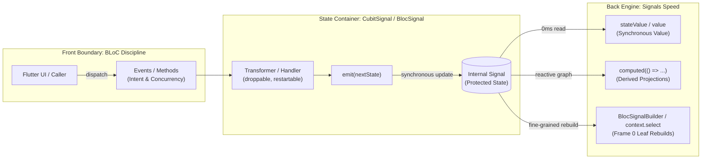

## The False Dilemma of Modern Flutter State Management

Every couple of years, the Flutter community finds itself trapped in a recurring debate. 

On one side, you have developers who grew up on the classic BLoC pattern. They value structure. They want events to represent user intent, they want state transitions to pass through an observable pipeline, and they want concurrency tools like debounce and restartable handlers to prevent double-taps and race conditions. But classic BLoC came with an architectural tax: everything was built on asynchronous Dart `Stream` pipes. Reading the current state required fighting microtask queues, listening to streams meant writing cancellation boilerplate, and setting a debugger breakpoint often severed the call stack.

On the other side, you have the rise of reactive Signals. Signals offer immediate, frame-accurate reads (`0ms` latency), memoized `computed()` expressions, and surgical widget rebuilds. But raw signals offer little architectural guidance. When teams adopt raw signals without a structural boundary, they often scatter mutable signals across global variables or widget files, write ad-hoc boolean flags to prevent asynchronous double-clicks, and invent custom lifecycle rules.

Faced with this choice, developers often ask: *Do I really need to learn an entirely new third paradigm?*

The answer is no. You do not need another complex mental model. In fact, you can understand the entire architecture through one sentence:

> **A Cubit or Bloc is simply a container that holds and protects a Signal.**



Once you see the relationship this way, the boundary becomes clear:
* **BLoC protects how state changes.** It guards the front door with methods or declarative events and concurrency transformers.
* **Signals optimizes how state is read.** It powers the back door with synchronous reads, dependency tracking, and cached computations.

If you know how to call a method or dispatch an event in BLoC, and you know how to read a value or write a `computed` expression in Signals, you already know 90% of `BlocSignal`.

---

## How Much BLoC Do You Actually Need?

Classic BLoC introduced patterns that transformed Flutter architecture. But it also bundled mechanical details that were artifacts of Dart in 2018 rather than timeless principles.

### What to Keep from BLoC

1. **Declarative Intent (Events)**: Modeling user actions as immutable objects (for example `CartItemAdded(item)`) separates *what happened* from *how the system responds*. It provides clear traceability and lets teams inspect the stream of user actions.
2. **Concurrency Control at the Boundary**: Asynchronous events in user interfaces collide. Users tap buttons twice, flings trigger rapid scroll updates, and search bars emit keystrokes every 50ms. Transformers like `droppable()`, `restartable()`, and `debounce()` manage these traffic jams before they reach business logic.
3. **Container Lifecycles and Telemetry**: Centralizing state into a container with lifecycle hooks (`onCreate`, `onChange`, `onTransition`, `onError`, `close`) gives developers a single choke point for logging, error reporting, and distributed tracing.

### What to Discard from BLoC

1. **Microtask-Driven Streams**: `StreamController` was designed for asynchronous external I/O (sockets, files, hardware sensors). Using streams for in-memory UI state introduces microtask hops that delay state propagation by at least one event-loop cycle.
2. **Microtask Amnesia During Debugging**: When an event handler runs across an asynchronous stream boundary, the original call stack is lost. Setting a breakpoint inside `emit()` often shows only three lines of runtime plumbing (`_microtaskLoop`, `_scheduleImmediate`, `_StreamController`).
3. **Stream Cancellation Ceremonies**: Managing multiple `StreamSubscription` instances and remembering to cancel them on widget disposal creates unnecessary housekeeping.

---

## How Much Signals Do You Actually Need?

Signals fundamentally fix the performance and ergonomics of reading state. But raw signals are building blocks, not an architectural architecture.

### What to Keep from Signals

1. **Synchronous, 0ms Reads**: You read the current state directly via a property (`cubit.value` or `cubit.stateValue`). There is no `await`, no `StreamBuilder`, and no waiting for the event loop.
2. **Memoized Derived State (`computed`)**: Projections (such as whether a shopping cart is empty or whether a user has administrative privileges) calculate lazily, cache their results, and invalidate only when their upstream dependencies change.
3. **Surgical, Same-Frame Rebuilds**: When a state container calls `emit(newState)`, dependent widget elements mark themselves dirty synchronously in the exact same frame. Only the widgets observing that specific slice of state re-render.

### What to Discard from Signals

1. **Unbounded Mutable State**: Exposing raw mutable signals (`signal.value = x`) directly in widget files allows any part of the UI to mutate state at will. The mutation surface area scales with the size of the codebase.
2. **Ad-Hoc Concurrency Mutexes**: Raw signals have no built-in notion of event queues. When an asynchronous operation is triggered, developers are forced to manually track boolean flags (`bool _isSaving = false`) or construct custom locks to prevent race conditions.
3. **Orphaned Effects and Leaks**: Manually attaching long-lived `effect()` callbacks without a clear lifecycle owner makes tracking memory reclamation harder.

---

## The Irreducible Model: Inside the Container

When you look inside `CubitSignal` or `BlocSignal`, the mechanics are simple:

```dart
abstract class CubitSignal<State> extends BlocSignalBase<State> {
  CubitSignal({required State initialState}) {
    // 1. The internal signal holds the state
    _stateSignal = signal<State>(initialState);
  }

  late final Signal<State> _stateSignal;

  // 2. The outside world can only read, never write
  ReadonlySignal<State> get state => _stateSignal.readonly();

  // 3. Raw synchronous value access
  State get value => _stateSignal.value;

  // 4. Protected mutation
  @protected
  void emit(State newState) {
    if (isClosed || equals(stateValue, newState)) return;
    _stateSignal.value = newState;
  }
}
```

The container does two jobs:
1. It hides the mutable setter (`_stateSignal.value = ...`) so outside callers cannot modify state behind your back.
2. It exposes a `ReadonlySignal<State>` and a synchronous getter (`value`) so consumers can read and observe state without friction.

---

## CubitSignal in 30 Seconds: Methods In, Signal Out

If you need a straightforward container for a feature, use `CubitSignal`. You expose methods to describe actions, and call `emit()` to update the state.

Here is a complete counter container:

```dart
import 'package:bloc_signals/bloc_signals.dart';

class CounterCubit extends CubitSignal<int> {
  CounterCubit() : super(initialState: 0);

  // Derived state: memoized and dependency-tracked
  late final isEven = computed(() => value % 2 == 0);

  void increment() => emit(value + 1);
  void decrement() => emit(value - 1);
}
```

Notice what happens:
* `increment()` calls `emit(value + 1)`.
* `value` is read synchronously.
* `isEven` is declared directly on the cubit as a `late final` computed signal. It recalculates only when `value` changes.

In your Flutter presentation layer:

```dart
class CounterView extends StatelessWidget {
  const CounterView({super.key});

  @override
  Widget build(BuildContext context) {
    final cubit = context.read<CounterCubit>();

    return Scaffold(
      body: Center(
        child: Column(
          mainAxisSize: MainAxisSize.min,
          children: [
            // Surgical rebuild: only this builder rebuilds when count changes
            BlocSignalBuilder<CounterCubit, int>(
              builder: (context, count) => Text(
                '$count',
                style: Theme.of(context).textTheme.headlineMedium,
              ),
            ),
            // Consumes the cubit's memoized computed signal directly.
            // Only rebuilds when the parity boolean actually flips (true <-> false).
            Builder(
              builder: (context) {
                final isEven = context.select<CounterCubit, bool>(
                  (c) => c.isEven.value,
                );
                return Text(
                  isEven ? 'Even Number' : 'Odd Number',
                  style: Theme.of(context).textTheme.titleMedium,
                );
              },
            ),
          ],
        ),
      ),
      floatingActionButton: FloatingActionButton(
        onPressed: cubit.increment,
        child: const Icon(Icons.add),
      ),
    );
  }
}
```

Notice what this accomplishes:
* **The business logic stays in the container**: The parity calculation (`value % 2 == 0`) lives inside `CounterCubit` as a `late final` computed signal. The view never duplicates or recalculates the formula.
* **Direct reactive consumption**: `context.select<CounterCubit, bool>((c) => c.isEven.value)` passes the cubit instance directly to the selector, letting the widget subscribe straight to the derived signal.
* **Filtered UI rebuilds**: When `count` increments from 2 to 4, the number in `BlocSignalBuilder` rebuilds, but `isEven` remains `true`. The parity `Builder` skips rebuilding entirely.

No streams. No `StreamBuilder`. No microtask lag. Calling `cubit.increment()` updates the widget in the exact same frame.

---

## BlocSignal in 60 Seconds: Events In, Transformers in the Middle, Signal Out

When your state changes involve asynchronous operations, debouncing, or concurrency constraints, `BlocSignal` gives you the event pipeline of BLoC without the streams.

Consider a search feature where rapid keystrokes must be canceled so only the latest query executes:

```dart
import 'package:bloc_signals/bloc_signals.dart';

sealed class SearchEvent {}

final class QueryChanged extends SearchEvent {
  QueryChanged(this.query);
  final String query;
}

sealed class SearchState {}
final class SearchInitial extends SearchState {}
final class SearchLoading extends SearchState {}
final class SearchSuccess extends SearchState {
  SearchSuccess(this.results);
  final List<String> results;
}

class SearchBloc extends BlocSignal<SearchEvent, SearchState> {
  SearchBloc(this._api) : super(initialState: SearchInitial()) {
    on<QueryChanged>(
      (event, emit) async {
        if (event.query.trim().isEmpty) {
          emit(SearchInitial());
          return;
        }

        emit(SearchLoading());
        final results = await _api.search(event.query);
        emit(SearchSuccess(results));
      },
      // Restartable cancels any in-flight search when a new query arrives
      transformer: restartable(),
    );
  }

  final SearchApi _api;
}
```

Here is what happens under the hood:
1. The UI dispatches `bloc.add(QueryChanged('flutter'))`.
2. The `restartable()` transformer coordinates the event. If the user types another letter before the previous network call finishes, the previous search handler is canceled.
3. When the handler calls `emit(SearchSuccess(results))`, it synchronously updates the internal signal.
4. Downstream widgets re-render immediately.

You get the concurrency control of BLoC, but because the underlying engine is a signal graph, synchronous inspections (`bloc.value` or `bloc.stateValue`) are always accurate and available.

---

## Comparing the Three Approaches

To see the architectural tradeoffs clearly, consider how classic BLoC, raw signals, and `BlocSignal` handle common frontend tasks:

| Capability | Classic flutter_bloc | Raw Signals | BlocSignal |
| :--- | :--- | :--- | :--- |
| **State Propagation** | Asynchronous (`Stream`) | Synchronous (`Signal`) | Synchronous (`Signal`) |
| **Reading Current State** | Asynchronous or cached field | Instant (`signal.value`) | Instant (`cubit.value`) |
| **Mutation Protection** | Protected (Methods / Events) | Unprotected (Direct `.value =`) | Protected (Methods / Events) |
| **Event Concurrency** | Yes (Rx stream transformers) | None (Manual mutexes) | Yes (Streamless transformers) |
| **Derived State** | Manual `distinct()` streams | Declarative `computed()` | Declarative `computed()` |
| **Call Stack on Breakpoint** | Severed at microtask loop | Intact | Intact |
| **Memory Cleanup** | `StreamSubscription.cancel()` | Manual effect cleanup | Automatic on `close()` |

---

## The Takeaway

Frontend architecture is often complicated by tools trying to solve every problem with a single hammer.

When state management relies entirely on asynchronous streams, it forces simple in-memory reads to pay an asynchronous tax. When state management relies entirely on raw, unconstrained signals, it leaves business logic without boundaries or concurrency protection.

`BlocSignal` avoids this dilemma by assigning each tool to the job it does best:
* **BLoC provides the discipline**: It defines the public interface, validates input, manages concurrency, and reports telemetry.
* **Signals provides the engine**: It calculates derived values lazily, tracks dependencies automatically, and updates the screen in the same frame.

You do not need to choose between discipline and performance. Put a signal inside a container, guard the entrance, and let the reactive graph handle the rest.
