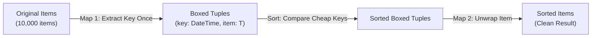

_This is Part 6 of the **Dart and Flutter** series—practical guides, architectural deep dives, and hard-earned engineering lessons from the field. Each article is completely standalone._

---

A few days ago, an article by Flutter developer Hammad Tariq popped up on my feed: [*"Rendering 10,000 Machine State Changes on a Timeline Without Freezing Flutter"*](https://medium.com/@HammadTariq598/rendering-10-000-machine-state-changes-on-a-timeline-without-freezing-flutter-c4b846c2612f). 

It was a solid piece of profiling detective work. Hammad was building a high-density timeline view in Flutter representing 10,000 machine state transitions. But every time the dataset loaded, the Flutter UI stuttered and dropped dozens of frames.

Under a section humorously and aptly titled **"The Original Sin"**, the author identified the culprit:

```dart
sorted.sort((a, b) => DateTime.parse(a.start).compareTo(DateTime.parse(b.start)));
```

To fix the frame freeze, Hammad introduced a clever optimization: map each item to a temporary helper class holding the pre-computed timestamp, sort the list using that cached value, and unwrap it:

```dart
// Step 1: Map to a wrapper holding the pre-computed sort key
final parsed = widget.activity.map(_ParsedActivity.new).toList();

// Step 2: Sort using the cheap, cached key
parsed.sort((a, b) => a.startUtc.compareTo(b.startUtc));

// Step 3: Unwrap and process down the pipeline
```

The UI freeze disappeared. The timeline ran smoothly.

When I read that section, I couldn't help but grin from ear to ear. As an engineer, watching someone independently discover an algorithmic optimization from first principles is pure joy. 

In this case, however, the moment was uniquely personal.

I gently opened the comment section and left a quick note:

> *"Almost looks like you could have used a Schwartzian Transform. :)"*

Because in 1994, I was the one who posted that exact pattern to Usenet.

---

## A Quick Trip to 1994: The Birth of an Idiom

Back in the early days of the web, on the Usenet newsgroup `comp.lang.perl`, someone asked how to sort a list of strings by an expensive key—specifically, sorting filenames by their file modification dates without calling the expensive `stat()` system call hundreds of thousands of times inside the comparison block.

I replied with a one-liner:

```perl
@sorted = map  { $_->[0] }
          sort { $a->[1] <=> $b->[1] }
          map  { [$_, expensive($_)] }
          @original;
```

Tom Christiansen dubbed it the **"Schwartzian Transform"**, and the name stuck across Wikipedia, CS textbooks, and standard libraries from Python (which built its famous DSU—Decorate-Sort-Undecorate—pattern directly on it) to Ruby, Lisp, and even a dedicated `schwartzSort` function in the D language standard library.

The principle is dead simple: **Map -> Sort -> Map**.



### The Math Behind The UI Freeze

Why does this matter so much in a client-side UI framework like Flutter?

Sorting algorithms like Timsort or Quicksort have an average time complexity of `O(N log N)` comparisons. For `N = 10,000` items:

> `N * log2(N) ≈ 10,000 * 13.3 ≈ 133,000 comparisons`

In the naive implementation:

```dart
sorted.sort((a, b) => DateTime.parse(a.start).compareTo(DateTime.parse(b.start)));
```

Because each comparison evaluates both `a` and `b`, you aren't calling `DateTime.parse()` 10,000 times. You are calling it **over 215,000 times!**

Parsing an ISO-8601 string requires regex/substring slicing, bounds checking, calendar math, and heap allocation. Doing that 215,000 times on a mobile device or browser main isolate easily eats 200ms to 600ms of CPU time. 

In Flutter, your frame budget is **16ms** (for 60 FPS) or **8ms** (for 120 FPS). Dropping 200ms+ of synchronous computation directly onto the UI thread guarantees an unskippable freeze.

By applying the Schwartzian Transform:
1. `DateTime.parse()` is called **exactly N times** (10,000 times).
2. The comparison callback only compares pre-computed integers/microsecond timestamps (`a.key.compareTo(b.key)`).
3. The items are unwrapped back to the original list.

---

## "Wait, Doesn't `package:collection` Solve This?"

When I talk to modern Dart developers about sorting by a derived key, the immediate reaction is usually:

> *"Randal, we don't need a custom pattern for this! Dart's official `package:collection` already has an extension method called `sortedBy`!"*

It sounds reasonable. You might be tempted to write:

```dart
import 'package:collection/collection.dart';

final sorted = widget.activity.sortedBy((a) => DateTime.parse(a.start));
```

It looks concise, idiomatic, and clean. 

**Except it doesn't solve the problem.**

If you inspect the actual implementation of `sortedBy` inside [`package:collection/src/iterable_extensions.dart`](https://github.com/dart-lang/core/blob/main/pkgs/collection/lib/src/iterable_extensions.dart):

```dart
List<T> sortedBy<K extends Comparable<K>>(K Function(T element) keyOf) {
  var elements = [...this];
  mergeSortBy<T, K>(elements, keyOf, compareComparable);
  return elements;
}
```

Dig deeper into `mergeSortBy` and `_movingInsertionSort` in `algorithms.dart`, and you will find lines like this:

```dart
while (min < max) {
  var mid = min + ((max - min) >> 1);
  if (compare(elementKey, keyOf(target[mid])) < 0) { // <-- keyOf is called inside the loop!
    max = mid;
  } else {
    min = mid + 1;
  }
}
```

`package:collection`'s `sortedBy` **does not cache the keys!** It re-evaluates `keyOf(element)` during merges and binary searches.

Let's look at the hard numbers.

---

## The Benchmark: Naive vs. `package:collection` vs. Schwartzian

I ran a rigorous benchmark on a 10,000-element list of ISO-8601 timestamped items on modern Dart:

```dart
// 1. Naive sort
items.sort((a, b) => DateTime.parse(a.start).compareTo(DateTime.parse(b.start)));

// 2. package:collection sortedBy
items.sortedBy((a) => DateTime.parse(a.start));

// 3. Modern Schwartzian Transform
items.schwartzianSortedBy((a) => DateTime.parse(a.start));
```

Here are the results:

| Sorting Strategy | Key Evaluations (`DateTime.parse`) | Execution Time | vs. Naive Sort |
| :--- | :---: | :---: | :---: |
| **Naive `List.sort()`** | **215,462** | **186 ms** | Baseline (UI freezes) |
| **`package:collection` `sortedBy()`** | **127,590** | **107 ms** | 1.7x faster (Still drops frames) |
| **Schwartzian Transform** | **10,000 (Exactly N)** | **14 ms** | **13.3x faster (Smooth 60 FPS)** |

`package:collection`'s `sortedBy` reduces key evaluations from 215,000 down to 127,000 because Merge Sort makes fewer total comparisons than Dart's dual-pivot QuickSort. But it is still executing **117,000 redundant `DateTime.parse()` calls!**

Only the Schwartzian Transform achieves the theoretical minimum: **exactly 10,000 evaluations**. At 14 milliseconds, the work fits neatly inside an animation tick without locking the isolate.

---

## Modern Dart 3: Zero Boilerplate with Records

In Hammad's article, their fix required declaring a dedicated helper class:

```dart
class _ParsedActivity {
  final Activity activity;
  final DateTime startUtc;
  _ParsedActivity(this.activity) : startUtc = DateTime.parse(activity.start);
}
```

Creating throwaway wrapper classes for every sort operation clutters your codebase with boilerplate, noise, and intermediate data transfers.

In 1994, Perl used untyped anonymous array references (`[$item, $key]`). In early Dart, you had to choose between custom classes or untyped `Map<String, dynamic>` maps with runtime casting.

**In modern Dart 3, Records give us the best of both worlds: zero boilerplate, strict compile-time types, and zero throwaway classes.**

Here is the entire transformation as a single Dart expression:

```dart
final sorted = [
  for (final item in widget.activity)
    (key: DateTime.parse(item.start), item: item),
]
  ..sort((a, b) => a.key.compareTo(b.key));

final result = [for (final entry in sorted) entry.item];
```

No class declarations. No dynamic casting. The compiler infers the intermediate list as `List<({DateTime key, Activity item})>`. It is strictly typed, efficient, and immediately legible.

---

## Packaging It Up: The `Iterable` Extension

We can make this completely seamless and reusable across your entire Flutter app by creating an extension on `Iterable<T>`.

Let's mirror the API conventions of `package:collection`, but explicitly optimize for expensive keys:

```dart
extension SchwartzianSortExtension<T> on Iterable<T> {
  /// Sorts elements by an expensive key using the Schwartzian Transform
  /// (Decorate-Sort-Undecorate).
  ///
  /// Guarantees that [keyOf] is invoked **exactly once** per element (O(N) calls),
  /// caching the derived keys in lightweight Dart 3 records during sorting.
  List<T> sortedByExpensive<K extends Comparable<K>>(K Function(T item) keyOf) {
    final boxed = [
      for (final item in this) (key: keyOf(item), item: item),
    ]..sort((a, b) => a.key.compareTo(b.key));

    return [for (final entry in boxed) entry.item];
  }

  /// Sorts elements by an expensive key using a custom [compare] function.
  List<T> sortedByCompareExpensive<K>(
    K Function(T item) keyOf,
    int Function(K a, K b) compare,
  ) {
    final boxed = [
      for (final item in this) (key: keyOf(item), item: item),
    ]..sort((a, b) => compare(a.key, b.key));

    return [for (final entry in boxed) entry.item];
  }
}
```

Now, that frame-dropping hot path in your Flutter timeline widget collapses to a one-line call:

```dart
// Clean, declarative, and 13x faster:
final sortedActivities = widget.activity.sortedByExpensive(
  (a) => DateTime.parse(a.start),
);
```

Or, if your parsing function is a top-level function or constructor tearoff:

```dart
final sortedDates = rawDateStrings.sortedByExpensive(DateTime.parse);
```

---

## When Should You Use This?

Like all architectural idioms, the Schwartzian Transform involves a trade-off: **CPU cycles vs. temporary heap allocations.**

Because it allocates a temporary list of lightweight records, you should use it judiciously:

### ✅ Use `sortedByExpensive` when:
* **The key transformation is non-trivial**: Parsing ISO-8601 dates, evaluating regular expressions, decoding JSON fragments, reading metadata from disk, or hashing strings.
* **The collection is moderately large**: Sorting hundreds or thousands of items where `O(N log N)` repeated calculations will blow through your 16ms frame budget.
* **The key cannot be permanently stored** on the model object because the model is an immutable DTO from a third-party package or network schema.

### ❌ Stick with standard `sort()` or `package:collection` when:
* **The key is already a primitive property access**: e.g., `list.sortedBy((e) => e.age)` or `list.sortedBy((e) => e.timestamp)`. Accessing a field that is already an integer or `DateTime` is virtually instantaneous. In that case, allocating intermediate records adds unnecessary memory churn.

---

## Full Circle

It is always fascinating to see how the core principles of software engineering persist across decades and languages.

Whether it was Perl in 1994, Python in the 2000s, or Flutter on a 120Hz mobile display in 2026, the laws of algorithmic complexity don't change: **if calculating something is expensive, calculate it once.**

With Dart 3's records and extensions, we finally have the cleanest, most type-safe syntax the Schwartzian Transform has ever enjoyed. 

And to Hammad: thank you for a great article and for profiling the problem so clearly. You arrived at the exact right solution—now you know the 30-year history behind it!

*(Curious about the original 1994 Usenet thread and the folklore behind the name? Check out [The History of the Schwartzian Transform](https://www.perl.com/article/the-history-of-the-schwartzian-transform/) on Perl.com).*

---

### What's your take?
Have you ever tracked down a mysterious UI jank spike in Flutter only to find an innocent-looking `compareTo` parsing strings or querying objects in a loop? Do you think `sortedByExpensive` belongs in `package:collection`? Drop your thoughts in the comments!

---

*Randal L. Schwartz is a Google Developer Expert (GDE) for Dart & Flutter and veteran software architect.*

* 📺 Watch deep dives and walkthroughs on YouTube: **[@RandalOnDartAndFlutter](https://www.youtube.com/@RandalOnDartAndFlutter)**
* 💻 Connect on GitHub: **[@RandalSchwartz](https://github.com/RandalSchwartz)**

