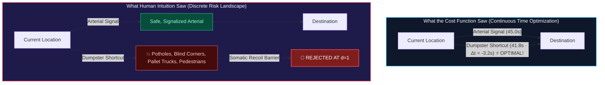
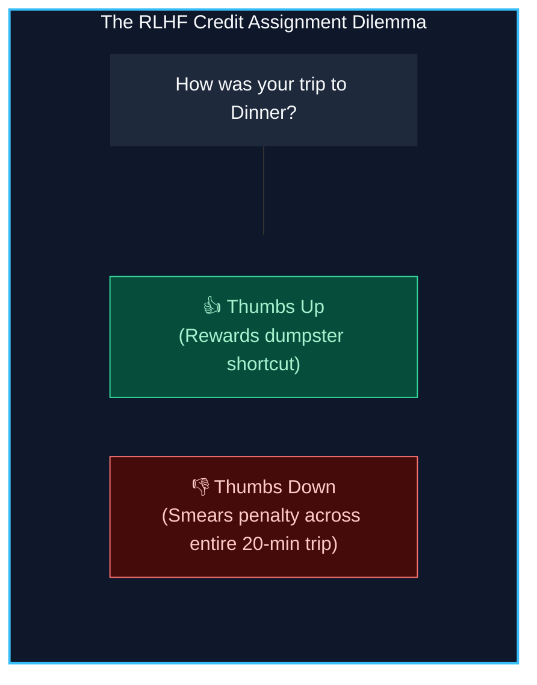
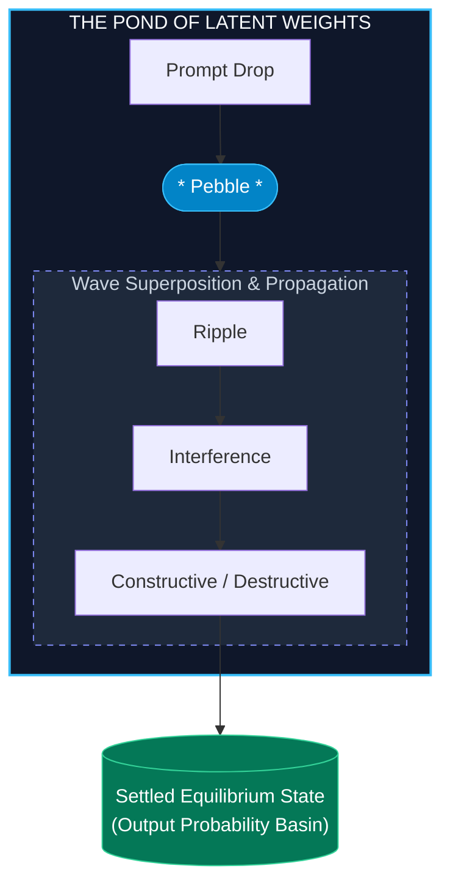
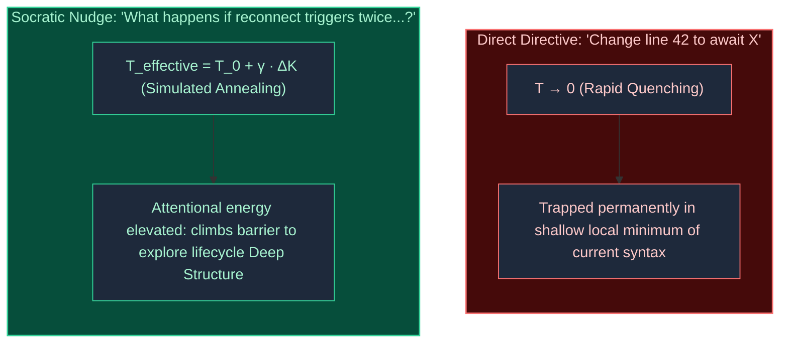
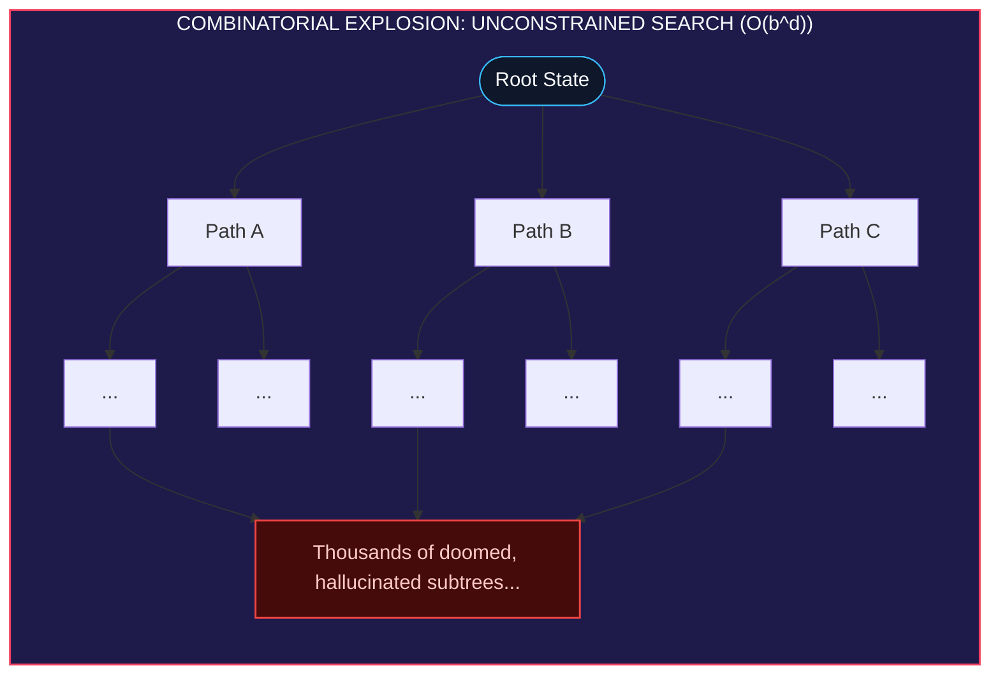
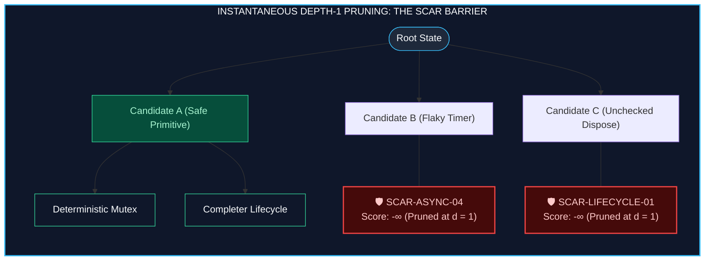
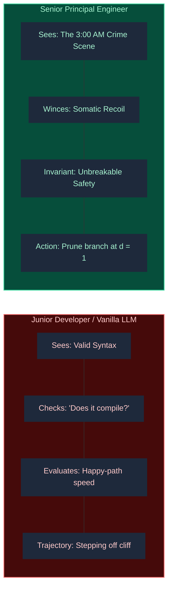
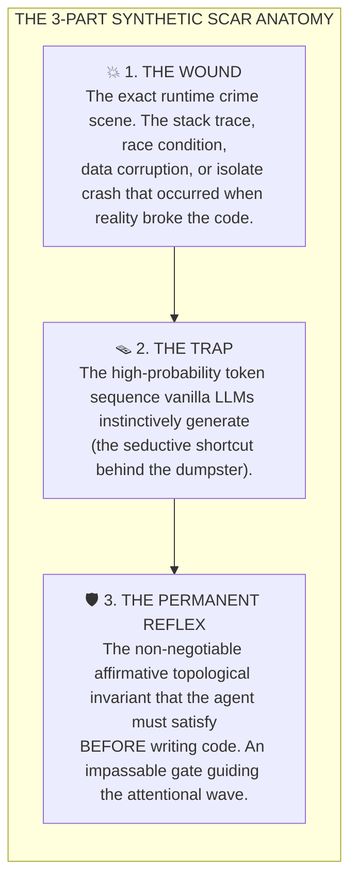
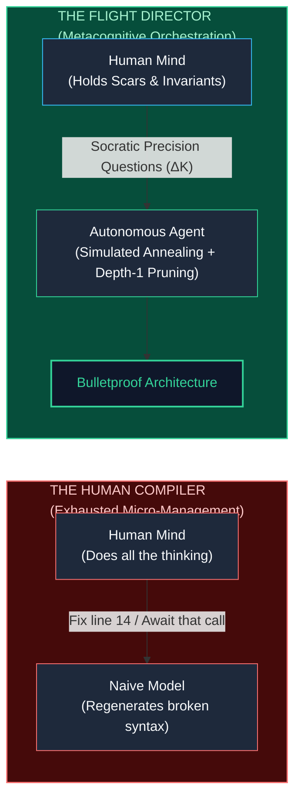

> *"Thirty, maybe even forty years ago, I said that if we were ever to create a synthetic mind, it would have to work in such a way that we couldn't debug it by single-stepping through an algorithm. It will be more like how a pond computes the waves from a pebble dropped into it."*  
> — **Randal L. Schwartz**

---

## 1. The Google Maps Dilemma: The Everyday Face of RLHF

Imagine you are driving to a dinner meeting in an unfamiliar part of town. 

Five hundred feet ahead of you sits the main entrance: a wide, four-lane, signalized intersection with a dedicated turn lane, high-visibility crosswalks, and an illuminated green arrow. It is safe, predictable, and engineered for high volume.

Suddenly, your navigation app chirps with frantic urgency:

> *"Turn right in 50 feet. Then immediately turn left."*

Against your better judgment, you follow the instruction. The app routes you off the arterial avenue, down a narrow access alley, behind a strip-mall shopping center, rattling over speed bumps and broken asphalt. You squeeze past a row of commercial garbage dumpsters, navigating a blind, unlit corner where a delivery truck is unloading pallets and a pedestrian is walking a dog. You finally pop out of the driveway directly into the destination parking lot.

Why did the algorithm do this?

Because its routing engine solved a mathematical optimization problem. It calculated that cutting behind the dumpsters would save **3.2 seconds** compared to waiting for the green arrow at the signalized intersection. On paper, across continuous time, `Δt = -3.2s`. To the cost function, the dumpster alley was the optimal global minimum.



Then comes the real punchline. As you put the car in park, the screen lights up with a cheerful feedback modal:



Welcome to the **Credit Assignment Disaster** of modern reinforcement learning.

If you tap **👎**, what happens? The system records a blunt, scalar negative penalty. That single negative bit gets smeared diffusely across the entire twenty-minute journey: the freeway cruise, the exit ramp, the speed limit estimates, the traffic predictions. The algorithm does not know you hated the dumpster maneuver; it only receives a blurry, noisy loss signal.

If you tap **👍** because you arrived in one piece and the food smells good, congratulations: you just reinforced the dumpster shortcut for thousands of other drivers tomorrow.

This is the exact pathology that plagues modern foundation models trained on **Reinforcement Learning from Human Feedback (RLHF)**. By compressing complex, high-dimensional software decisions into scalar preference scores (`r` in `[-1, +1]`), RLHF cannot perform surgical edge surgery on discrete failure modes. It optimizes for superficial plausibility and short-term metrics while remaining utterly blind to catastrophic downside risks.

---

## 2. The Pond Analogy: Non-Von Neumann Computation

To understand why traditional debugging methods collapse when applied to generative AI, we have to revisit an old insight into non-Von Neumann computing.

For decades, software engineers have operated inside the comfort of deterministic Turing machines. In classical Von Neumann architectures, execution proceeds step by step, clock cycle by clock cycle:

```plaintext
State(t+1) = f( State(t), Instruction(t) )
```

If a variable corrupts or a pointer dereferences to null, you fire up an interactive debugger. You set a breakpoint. You step into the function, inspect the stack frame, and identify the single instruction where state deviated from intention. Computing was arithmetic, linear, and discrete.

This brings us directly to the observation quoted at the top of this article. 

Thirty, maybe even forty years ago, contemplating what a true synthetic mind would look like, I used to tell anyone who would listen that we would never be able to debug it by single-stepping through an algorithm. It wouldn't be arithmetic; it would work much more like how a pond computes the interfering ripples from a pebble dropped into it.

Looking at modern transformer architectures, it turns out that intuition was literally true.



In a transformer model with hundreds of billions of parameters, computation does not move in a single-file line. Computation is the **constructive and destructive interference of attentional waves** across a vast, high-dimensional semantic pond.

When you submit a prompt to Claude, GPT-4, or Gemini, you are dropping a pebble into that pond. The ripples—attentional activations across dozens of transformer layers and hundreds of attention heads—propagate outward, ricochet off the stored geometric weights of its training corpus, interfere with each other, and settle into a lowest-energy equilibrium on the probability manifold. That settled wave pattern is the next predicted token.

Now, imagine what happens when an engineer tries to "debug" that wave pattern the way they debug a C++ program.

When an AI writes buggy code, the naive reaction is to bark an imperative, line-by-line patch: *"Change line 42 to await the callback."* 

By doing that, you are dropping a jagged concrete block directly into the pond. You might temporarily displace the ripple at line 42, but you kick up violent, chaotic wakes across the surrounding latent space. The model "fixes" the immediate syntax error, only to subtly unhook an error boundary, drop an event listener, or hallucinate an import three lines below.

You cannot single-step a pond. You have to reshape the shoreline.

---

## 3. Escaping the "Human Compiler"

Most developers using coding assistants today are trapped in a state of quiet, grinding exhaustion. They have unknowingly become **human compilers**.

The workflow looks depressingly familiar:
1. The developer asks the agent to build an asynchronous component.
2. The agent outputs four hundred lines of beautifully formatted, completely broken code.
3. The developer reads the code, spots a lifecycle leak, and manually instructs: *"On line 14, save that stream subscription to a variable and cancel it in dispose."*
4. The agent replies with sycophantic enthusiasm: *"Certainly! I have updated the code to cancel the subscription in dispose!"*
5. The developer notices that now the state mutation throws after unmount. The developer types: *"Now check if the widget is mounted before calling setState."*
6. The agent complies. But now double-initialization triggers duplicate network requests.

The developer is doing all the heavy cognitive lifting—holding the mental model of the lifecycle, tracing asynchronous timelines, spotting race conditions—while the multi-billion-dollar neural network acts as little more than an auto-complete typist.

### The Naive Patch vs. The Socratic Impulse

Let us look at a concrete, real-world failure mode common to asynchronous applications (such as Dart, Flutter, Node.js, or React).

Consider an agent attempting to listen to a real-time event stream:

```dart
// The Agent's First Attempt (The Happy-Path Trap):
void initListener() {
  _eventService.onEvent.listen((event) {
    setState(() {
      _latestEvent = event;
    });
  });
}
```

This code works brilliantly for three seconds in a local demo. But the moment the user navigates away while an event is in flight, the framework throws a fatal exception: `setState() called after dispose()`.

#### The Human Compiler Response (Zero-Temperature Quenching)
The frustrated engineer issues a direct directive:

> *"Store the subscription in `_sub` and cancel it inside `dispose()`."*

The model complies:

```dart
StreamSubscription? _sub;

void initListener() {
  _sub = _eventService.onEvent.listen((event) {
    setState(() {
      _latestEvent = event;
    });
  });
}

@override
void dispose() {
  _sub?.cancel();
  super.dispose();
}
```

The human compiler sighs with relief and moves on. **And the code is still a ticking time bomb.**

Why? Because the imperative directive only patched the single token coordinates specified by the human. It treated the model like a Von Neumann processor. It did nothing to alter the agent's underlying understanding of asynchronous lifecycles:
* What happens if `initListener()` is called twice during a configuration rebuild? (Duplicate listeners leak in memory).
* What if the listener callback triggers an asynchronous `Future` that completes *after* `dispose()` runs? (`_sub.cancel()` does not abort in-flight asynchronous operations already scheduled on the microtask queue).
* What happens if the stream emits an error? (Unhandled stream error crashes the process).

#### The Socratic Response (Simulated Annealing)
Now observe what happens when an experienced mentor intervenes not with a directive, but with a **Socratic precision question**:

> *"What happens to this subscription if `initListener()` is triggered multiple times during rapid reconnects, or if an event callback is awaiting an HTTP call when the user leaves the screen?"*

In the physics of computation, this question is not an edit; it is a **kinetic impulse** (`ΔK`).



In physics, **simulated annealing** is a technique used to find the global minimum of a complex energy landscape. If you cool a molten metal too fast (quenching), the atoms freeze into a brittle, defective crystalline structure trapped in a shallow local minimum. To create a strong, resilient metal, you have to reheat it and cool it slowly, allowing the atoms to settle into a globally optimal lattice.

A direct code directive is rapid quenching: it freezes the code into the shallowest local minimum of the existing syntax. 

A Socratic question reheats the system. It raises the effective cognitive temperature of the model's self-attention layers. Instead of calculating the next token from the narrow context of `line 42`, the attention heads are forced to project forward along temporal dimensions: tracing reconnection loops, checking dispose boundaries, and evaluating concurrent microtask queues.

The result is not a band-aid; it is systemic architecture:

```dart
// The Post-Socratic Architecture:
StreamSubscription? _sub;
CancelableOperation? _inFlightRequest;

void initListener() {
  // 1. Guard against duplicate listener re-entrancy
  _sub?.cancel();
  
  _sub = _eventService.onEvent.listen(
    (event) async {
      // 2. Track in-flight asynchronous work
      _inFlightRequest?.cancel();
      _inFlightRequest = CancelableOperation.fromFuture(_processEvent(event));
      
      final result = await _inFlightRequest!.valueOrCancellation();
      if (result == null || !mounted) return; // 3. Guard unmounted execution
      
      setState(() => _latestEvent = result);
    },
    onError: (error, stack) => _handleStreamError(error, stack), // 4. Unhandled error barrier
  );
}

@override
void dispose() {
  _sub?.cancel();
  _inFlightRequest?.cancel();
  super.dispose();
}
```

---

## 4. Alpha-Beta Pruning: Severing Doomed Trees at Depth 1

With the arrival of modern reasoning models (such as o1, o3-mini, Gemini Flash Thinking, and Claude 3.7 Sonnet in extended thinking mode), AI agents now routinely generate thousands of "thinking tokens" before producing a single character of code.

Practitioners assumed that more thinking tokens would automatically yield better architecture. But anyone who has watched a reasoning model burn five thousand tokens rationalizing a fundamentally flawed idea knows the truth:

**Unconstrained reasoning compute simply gives an agent more room to build brilliant rationalizations for catastrophic anti-patterns.**

In computer science, searching through potential actions forms a branching tree:

```plaintext
Search Complexity = O( b^d )
```

Where `b` is the branching factor (how many decisions the agent considers at each junction) and `d` is the reasoning depth. Without constraints, the tree explodes exponentially into a combinatorial thicket:



Without boundaries, the model wastes thousands of tokens wandering down branches that appear syntactically plausible on the surface, but lead to architectural dead ends.

In classical two-player game theory (such as high-level chess engines like Stockfish), how does an algorithm evaluate millions of positions without melting the CPU? 

It uses **Alpha-Beta Pruning**.

The fundamental rule of Alpha-Beta pruning is simple: the instant the search engine discovers that a candidate move allows the opponent an immediate checkmate or captures an undefended queen, that move trajectory is assigned a score of `-∞`. 

The engine does not waste a single clock cycle calculating twenty moves deep into that subtree. The entire branch is pruned at depth `d = 1`.

A **Synthetic Scar** is the software engineering equivalent of an Alpha-Beta cutoff.

When an autonomous coding agent considers resolving an asynchronous race condition by adding a hardcoded `await Future.delayed(Duration(milliseconds: 100))`, a naive model will spend three paragraphs explaining why a hundred milliseconds is "probably enough time for the database to finish."

If the agent has been inoculated with `SCAR-ASYNC-04`—a unique classification code from our research project's soon-to-be-published scar registry database (cataloging "The Sleep-Wait Race Hazard")—the scar acts as an instantaneous Alpha-Beta barrier:

```plaintext
If Candidate_Plan ∩ Known_Trap_Domain != ∅ 
  ===> Score = -∞ 
  ===> Prune Branch at Depth 1
```

By assigning a score of `-∞` to the known failure mode, the entire doomed subtree is severed before the agent can start hallucinating rationalizations:



The branch is severed immediately. The agent does not spend its reasoning budget rationalizing a flaky timer; it is forced to explore deterministic synchronization primitives (completers, mutexes, streams) before it writes a single line of code.

---

## 5. Thinking vs. "Thinking About Thinking": The NLP Meta-Model

This brings us to the core of cognitive architecture: the difference between **thinking** and **thinking about thinking** (metacognition).

Most prompt engineering remains stuck at the first level:
* **Level 1 (Thinking)**: The model writes code or follows an explicit imperative instruction (*"Always write clean code"*, *"Do not use global variables"*).
* **Level 2 (Thinking About Thinking)**: Examining *why* the model reaches for a specific failure mode, uncovering the *inferred human intuition* that rejects it, and engineering a linguistic structure that permanently prevents the trap.

To understand why simple prompt instructions fail so predictably, we have to look at the foundations of cognitive linguistics developed by Richard Bandler and John Grinder in the **Neuro-Linguistic Programming (NLP) Meta-Model** (1975), derived from Noam Chomsky's transformational grammar.

### Surface Structure vs. Deep Structure
Chomsky demonstrated that language exists on two layers:
1. **Surface Structure**: The literal words, tokens, or syntax presented to the eye.
2. **Deep Structure**: The underlying semantic reality—the complete relational graph of actors, actions, temporal constraints, and consequences.

Large language models are pre-trained predominantly on Surface Structure. They are masters of syntactic mimicry. They know that an `async` function generally has an `await`, and that a `try` block is followed by a `catch`. 

When an LLM produces buggy code, it is not because it lacks the tokens; it is because it suffered a **Deep Structure collapse**.

Bandler and Grinder identified three primary linguistic mechanisms through which Deep Structure is lost when humans (and neural networks) communicate. In our soon-to-be-published scar registry database—which catalogs hundreds of verified failure modes under unique tracking identifiers—each primary cognitive distortion maps directly to an indexed, permanent scar:

| Meta-Model Trap | Cognitive Manifestation | Registry Scar Code |
| :--- | :--- | :--- |
| **1. Generalization** | Taking one specific pattern and treating it as a universal law | `SCAR-ARCH-01` *(Premature Abstraction & The 3-Point Plane)* |
| **2. Deletion** | Completely omitting crucial context, lifecycle states, or error paths | `SCAR-REFACTOR-01` *(The Unspoken Variables Trap)* |
| **3. Distortion** | Creating false equivalences or unnecessary shims of imaginary complexity | `SCAR-ARCH-02` *(Identity Pass-Through Shims)* |

1. **Generalization**: The model sees a pattern work once, and immediately generalizes it into an architectural dogma. It builds a five-layer abstract generic repository pattern with factory interfaces to fetch a static list of seven strings.
2. **Deletion**: The model deletes the harsh realities of physics. It assumes the network never drops packets, the user never hits the back button mid-flight, and the device never runs out of memory.
3. **Distortion**: The model invents illusory requirements, wrapping simple, direct function calls in layers of identity pass-through shims that provide zero operational value.

### The "Pink Elephant" Paradox (The Negation Defect)
Why can't you just add negative rules to the agent's prompt? Why can't you just say: *"Do not write unawaited futures"* or *"Do not use premature abstraction"*?

Because of the **Negation Representation Defect**.

If I tell you right now: **"Do not think of a pink elephant,"** what is the very first thing your brain does?

You must mentally construct the representation of a pink elephant before your conscious mind can attempt to suppress it.

In an autoregressive transformer, the mechanism is even more unforgiving. When you write a negative constraint in a system prompt—*"Do not write unawaited futures"*—the self-attention mechanism processes the token embeddings for `unawaited` and `futures`. You have just injected high attentional energy directly into the semantic vector space of the forbidden pattern!

When the model enters a complex generation loop with high cognitive load, the self-attention heads attend to the most salient tokens in the context window. The negation ("Do not") decays, while the heavily energized concept ("unawaited futures") bleeds straight into the output tokens.

**You cannot ban a negative without providing an affirmative attractor.**

---

## 6. Inferred Human Intuition: Translating the Wince

When a thirty-year veteran principal engineer looks at a junior developer's pull request and instantly rejects a line of code, how did they do it?

Did they sit down with a pencil and trace out a formal mathematical proof? 

Never. As neuroscientist Antonio Damasio established in his **Somatic Marker Hypothesis**, the senior engineer experienced an immediate **visceral recoil**. Before analytical deduction even started, their nervous system fired a subcortical somatic warning: a gut feeling, a wince, a sudden cognitive brake that whispered: *"No. Don't turn behind that dumpster."*

That wince is the physical manifestation of **inferred intuition**. It is the compressed, consolidated memory of five hundred past 3:00 AM outages, broken releases, and debugging marathons.



The emerging success of the **Synthetic Scar Architecture** is not that we wrote down a bunch of obvious coding guidelines. Obvious guidelines are useless; LLMs already have all of Stack Overflow and the official documentation memorized.

The true breakthrough is **metacognitive extraction**:
1. We wait for the agent to fail in a real, complex production codebase.
2. When the failure occurs, we do not simply fix the line like a human compiler. We pause and observe the **inferred human intuition**: *Why did the veteran engineer wince? What exact invariant did the human's gut recognize that the model's forward attention missed?*
3. We deconstruct the failure through the NLP Meta-Model: What was Deleted? What was Distorted? What was Generalised?
4. We codify that insight not as an easily ignored negative imperative, but as a **3-part Synthetic Scar**:



Notice that the **Permanent Reflex** is never phrased as a negative prohibition. It is an affirmative operational invariant:
* Not: *"Don't let streams leak."*
* But: *"Bind every stream subscription to a teardown queue verified by an explicit cancellation test probe before touching implementation logic."*

---

## 7. From Human Compiler to Flight Director

When you change how you prompt, your entire relationship with artificial intelligence transforms.

If you treat the model as an imperative Von Neumann processor, barking line-by-line instructions and hand-correcting its syntax, you will remain trapped as an exhausted, underpaid human compiler. You will spend your days single-stepping through an ocean of hallucinated ripples.



When you step up to **metacognitive prompting**:
* You stop supplying code patches and start injecting Socratic kinetic impulses (`ΔK`).
* You let simulated annealing do the work of exploring the solution space.
* You install Synthetic Scars that execute instantaneous Alpha-Beta pruning at depth `d = 1`.
* You decode your own subconscious engineering trauma into affirmative topological invariants.

You cease to be the typist cleaning up after a reckless intern. You become the **Flight Director**: sitting at the console, monitoring telemetry, holding the non-negotiable landing keys, and watching an autonomous system navigate hostile territory with the battle-hardened instincts of a veteran.

---

### Coming Up in Part 4:
In **Part 4**, we will pull back the curtain on how we systematically extract these survival instincts from half a century of software engineering history:
* **The Rapid-Regret Commit Signature**: How to mine golden scars from one-hour follow-up Git patches across thousands of repositories.
* **The Riverbank Theorem**: Why rigid invariants do not stifle AI creativity, but are the exact prerequisite for fearless, high-temperature innovation.
* **The Framework Poka-Yoke Axiom**: Banning "developer error" forever by fixing the enabling API contract.

---

*The formal academic paper, theoretical proofs, and empirical registry of 96 production field tests are maintained in the [Synthetic Scars Research Repository](https://github.com/RandalSchwartz/Scars).*
