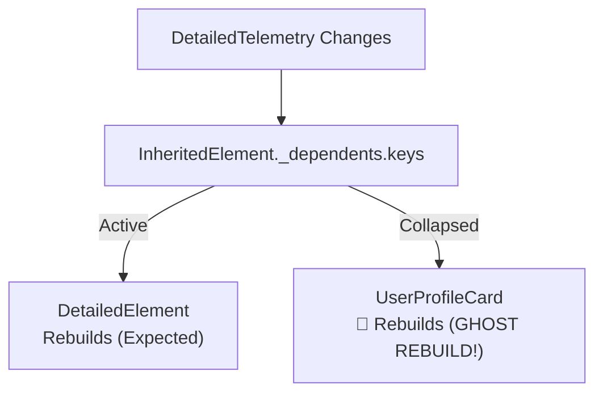
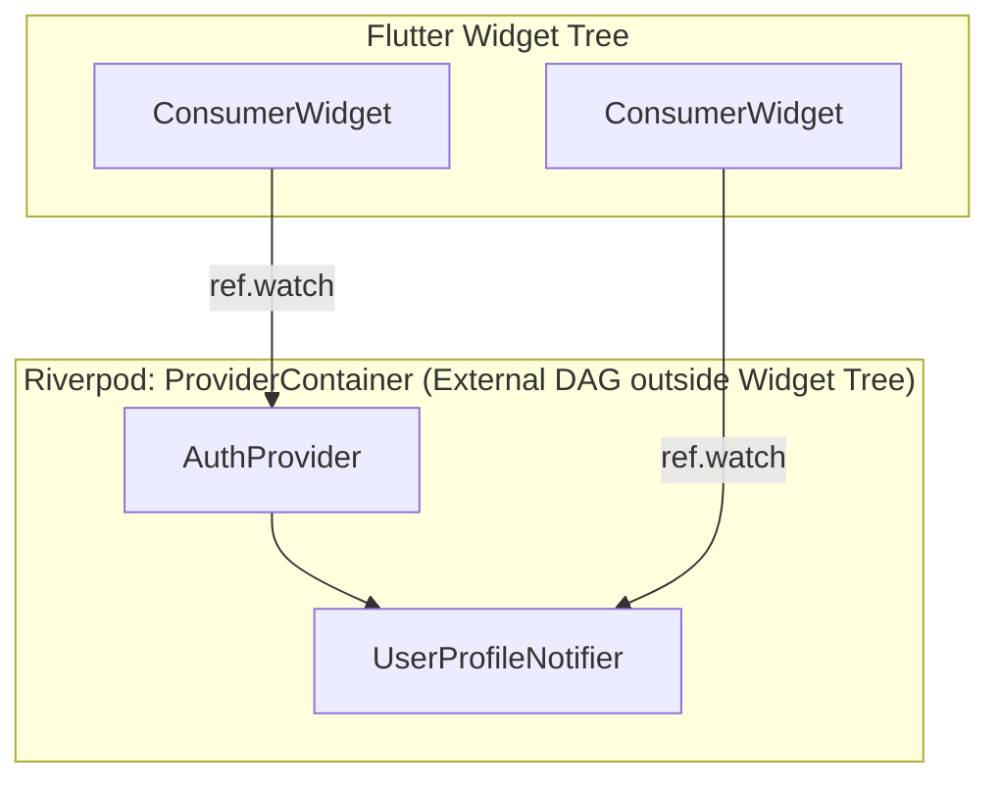
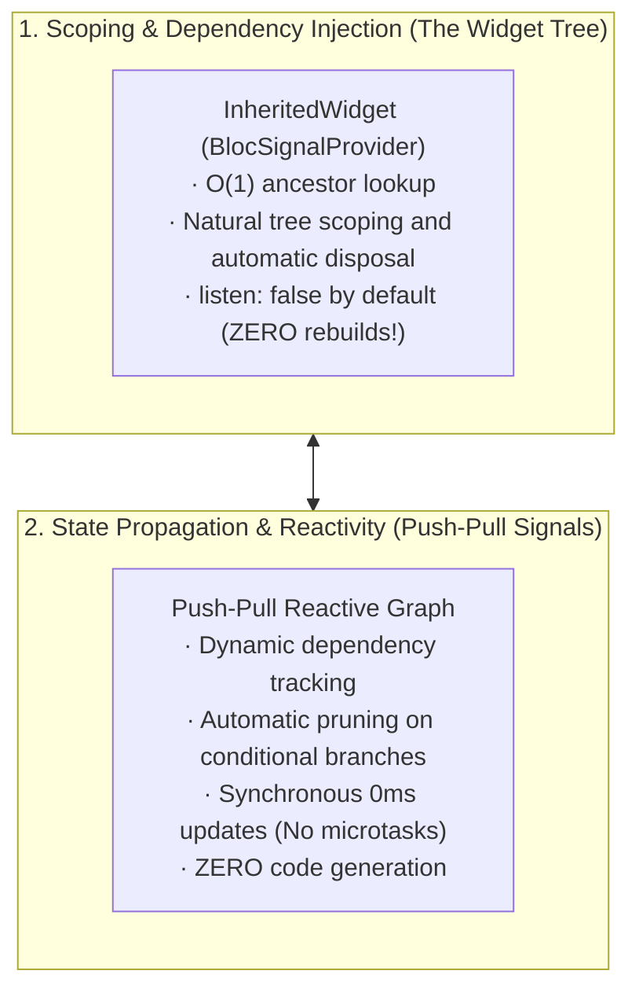

## The Invisible Grain of Sand

Natural pearls do not form because an oyster feels creative. They form because an irritant—a sharp, microscopic grain of sand—lodges inside the shell. Unable to expel the foreign particle, the mollusk secretes layer upon layer of lustrous nacre to insulate itself from the pain. 

In Flutter state management, **Riverpod was the original pearl.**

For years, it stood as one of the most brilliant, ambitious, and widely adopted architectural solutions in the Flutter ecosystem. But few developers today remember the exact mechanical flaw—the sharp grain of sand deep inside Flutter’s rendering pipeline—that necessitated Riverpod in the first place.

Almost every Flutter engineer learns that `Provider` was built on top of `InheritedWidget`. Far fewer engineers realize the fundamental defect lurking inside `dependOnInheritedWidgetOfExactType`:

> **The Flutter framework provides no mechanism to unlisten, unsubscribe, or deregister a dependency once registered.**

When state is read conditionally (for example, behind an `if` branch in a widget’s `build` method), that widget's underlying `Element` remains permanently registered in the ancestor's `_dependents` map until the element is completely unmounted from the tree. Long after the condition turns false, that widget continues to rebuild on every ancestor state change.

This single mechanical dead-end was the catalyst that drove Rémi Rousselet to abandon `package:provider` and build Riverpod outside the widget tree entirely.

And today, understanding that history illuminates why **[BlocSignal](https://blocsignal.dev)** represents the next natural evolution of Flutter state architecture: restoring `InheritedWidget` to its pure, intended role as a scoped dependency injector, while delegating state propagation to self-pruning push-pull reactive signals.

Here is the full story—from the core framework pull requests that sparked the revolution, to why you no longer need Riverpod's out-of-band complexity today.

---

## 📜 The Historical Paper Trail: The Day InheritedWidget Was Sealed

To understand why Riverpod had to exist, we must trace Flutter's historical commit log back to May 2019.

At the time, Rémi Rousselet’s `package:provider` was rapidly becoming the community standard for state management, ultimately earning an official endorsement from the Google Flutter team at Google I/O 2019. But as developers built larger apps, they hit an intractable wall: **how do you automatically clean up resources (`autoDispose`) when a widget stops needing them?**

In `InheritedWidget`, you couldn't.

### 1. The Rejected Pull Request: [flutter/flutter#33213](https://github.com/flutter/flutter/pull/33213) (May 2019)
Rémi opened a pull request to Flutter core titled:
**"Expose InheritedWidget subscription cancelation"**

His goal was straightforward: give `InheritedElement` an overridable hook so an ancestor could be notified when a dependent element unregisters or stops listening to its state.

Ian Hickson (Hixie), then Flutter’s tech lead, reviewed the pull request and closed it without merging:

> *"I think we should close this PR... until we have a stronger reason to make any changes to the framework for this."*
> — **Ian Hickson (Hixie)**

Hixie pointed out that Flutter's element reconciliation relies on extreme mechanical simplicity. Adding cancellation hooks and re-evaluating dependencies every frame would add overhead to the hot build loop. He recommended that if packages required dynamic subscriptions or stream lifecycles, they should vend builder widgets or Streams rather than altering `InheritedElement`.

### 2. The Great Realization: [flutter/flutter#106546](https://github.com/flutter/flutter/issues/106546) & [#106549](https://github.com/flutter/flutter/issues/106549) (June 2022)
Three years later, in issues discussing the architectural divergence between Provider and Riverpod, Rémi explicitly reflected on that rejection:

> *"This difference is the reason why I had to basically stop developing package:provider and instead start working on package:riverpod, as package:provider couldn't keep using the context syntax while supporting autoDispose which is a core feature for numerous commonly requested enhancements."*
> — **Rémi Rousselet**

Quoting Hixie on why dependencies are never cleared between builds:

> *"This was an intentional performance optimization - by not having to clear the dependencies each frame, we can avoid a lot of work."*
> — **Ian Hickson (Hixie)**

### 3. The Modern Admission: [flutter/flutter#140742](https://github.com/flutter/flutter/issues/140742) (December 2023)
By late 2023, the Flutter team authored a formal design document titled *"Conditionally listen on InheritedWidgets"*, acknowledging what package authors had known for half a decade: conditional reads in `InheritedWidget` cause unavoidable ghost rebuild cascades and prevent resources from being released.

The grain of sand was never removed from Flutter core.

---

## 🔍 The Mechanics of the Sand: The Ghost Rebuild Leak

To see why this was fatal for `package:provider`, look under the hood of Flutter’s framework code in `framework.dart`.

When a widget calls `context.dependOnInheritedWidgetOfExactType<T>()`:

```dart
@override
InheritedWidget dependOnInheritedElement(InheritedElement ancestor, { Object? aspect }) {
  _dependencies ??= HashSet<InheritedElement>();
  _dependencies!.add(ancestor);
  ancestor.updateDependencies(this, aspect);
  return ancestor.widget;
}
```

Inside `InheritedElement`:

```dart
@protected
void setDependencies(Element dependent, Object? value) {
  _dependents[dependent] = value;
}
```

Notice the asymmetry:
1. When your widget calls `dependOnInheritedWidgetOfExactType`, your `Element` is inserted into `ancestor._dependents`.
2. When the ancestor rebuilds, it executes `notifyClients()`:

```dart
@override
void notifyClients(InheritedWidget oldWidget) {
  for (final Element dependent in _dependents.keys) {
    notifyDependent(oldWidget, dependent);
  }
}
```

Now, consider this common, innocent conditional build pattern:

```dart
class UserProfileCard extends StatelessWidget {
  const UserProfileCard({super.key, required this.isExpanded});

  final bool isExpanded;

  @override
  Widget build(BuildContext context) {
    if (isExpanded) {
      // 🚩 Step 1: Element registers as dependent of DetailedTelemetry
      final telemetry = context.dependOnInheritedWidgetOfExactType<DetailedTelemetry>()!;
      return FullMetricsView(telemetry: telemetry);
    }

    // 🚩 Step 2: Collapsed view does NOT access DetailedTelemetry
    return const CompactProfileView();
  }
}
```

Here is the failure mode:
1. When `isExpanded` is `true`, `UserProfileCard` calls `dependOnInheritedWidgetOfExactType<DetailedTelemetry>()`. The framework inserts this card's `Element` into `DetailedTelemetry._dependents`.
2. Later, the user collapses the card (`isExpanded = false`). The widget rebuilds, returning `CompactProfileView()`. During this build, it never touches `DetailedTelemetry`.
3. **The trap:** Does Flutter remove the card's `Element` from `DetailedTelemetry._dependents`? **No.**
4. `Element._dependencies` and `InheritedElement._dependents` are **only cleared when the element is permanently deactivated or unmounted**.
5. Long after the card is collapsed, every single update to `DetailedTelemetry` iterates through `_dependents.keys`, flags `UserProfileCard` as dirty, and forces it to rebuild!



This explains why **`autoDispose` was impossible in `package:provider`**: an inherited provider could never know if its registered listeners still cared about its data or had long since branched away.

---

## 🦪 The First Pearl: Why Riverpod Was Needed

Faced with an immutable framework behavior that core maintainers declined to change, Rémi made a radical engineering choice:

**If the widget tree cannot unlisten, we must escape the widget tree.**

Riverpod achieved this by hoisting the entire state management layer out-of-band into an independent Dart container: `ProviderContainer`.



Because Riverpod controlled the graph outside of Flutter’s `Element` lifecycle, it could implement true dynamic dependency tracking:
* When a widget executed `ref.watch(provider)`, Riverpod recorded the dependency.
* On the next build, Riverpod checked which providers were *actually* read during that specific execution.
* If a provider was omitted during that build pass, Riverpod immediately decremented its listener counter.
* When the counter dropped to zero, `autoDispose` triggered, tearing down network sockets, canceling subscriptions, and freeing memory.

It was an architectural breakthrough. It solved the unlisten problem cleanly.

---

## 💸 The Architectural Taxes of Escaping the Tree

Riverpod solved the unlisten problem, but escaping the widget tree was not free. It introduced four structural taxes that teams have wrestled with ever since:

### 1. The Loss of Natural Tree Scoping
In Flutter, the widget tree *is* the scope. When you push a modal, show a tab view, or open a nested flow, Flutter's element hierarchy provides natural lifecycle boundaries. 

Because Riverpod's `ProviderContainer` is global and out-of-band, scoping state to a subtree required synthetic constructs: `ProviderScope(overrides: [...])`, `family` parameter keys, manual cache retention overrides, and cache-eviction timers. 

### 2. The Ceremony of `WidgetRef`
Because standard `BuildContext` could no longer be trusted to read state, every widget that needed reactivity had to abandon Flutter's native primitives:
* `StatelessWidget` became `ConsumerWidget`.
* `StatefulWidget` became `ConsumerStatefulWidget` with `ConsumerState`.
* Helper methods had to accept an explicit `WidgetRef ref` argument passed down through parameter drilling.

### 3. Microtask Gaps & Asynchronous Deferrals
Because Riverpod lives outside Flutter's synchronous build pipeline, state updates frequently defer across microtask queues to avoid "setState during build" collisions. While safe, this introduces asynchronous gaps where state transitions cannot be guaranteed to settle in the exact same synchronous frame.

### 4. The Code Generation (`@riverpod`) Mandate
To manage the combinatorial explosion of provider types (`Provider`, `FutureProvider`, `StreamProvider`, `StateNotifierProvider`, `ChangeNotifierProvider`, `NotifierProvider`, `AsyncNotifierProvider`), Riverpod 2.0 and 3.0 pivoted heavily to code generation. 

Developers had to run `build_runner` continuously in the background, deal with generated private base classes (`_$MyNotifier`), and tolerate sluggish IDE responsiveness during active feature development.

The sand had produced a pearl—but the pearl had grown heavy.

---

## 💡 The Second Pearl: The Modern Synthesis

Now, ask the crucial question:

**Was `InheritedWidget` actually bad at everything?**

**No!**

`InheritedWidget` is astonishingly good at one specific task: **scoping instances and performing `O(1)` ancestor lookups down the element tree.**

Flutter's internal `_inheritedElements` map is lightning-fast. Finding an ancestor object via `context.getInheritedWidgetOfExactType` (without registering a listener) takes single-digit nanoseconds. It respects route transitions, handles modal lifecycles effortlessly, and requires zero external containers.

`InheritedWidget` only failed when developers asked it to handle **fine-grained state propagation and subscription tracking.**

This realization unlocks the architecture of **[BlocSignal](https://blocsignal.dev)**:



By decoupling **dependency injection** from **state propagation**, we solve the entire problem without paying the out-of-band taxes.

---

## ⚡ How Push-Pull Signals Solve the Unlisten Problem Mechanically

How do signals avoid the lingering dependency trap without an out-of-band container or code generation?

Under the hood, `preact_signals` (which powers `bloc_signals`) uses an **epoch-based, push-pull reactive graph**.

When a reactive boundary—such as a `BlocSignalBuilder`, `Watch`, or `computed` signal—evaluates:

1. **Subscriber Stack Push**: The current node pushes itself onto a global active observer stack (`activeSubscriber`).
2. **Dynamic Dependency Tracking**: Every time a signal's `.value` is read, the signal notes the current observer and adds a bidirectional edge in the reactive graph.
3. **Execution & Diffing**: When the execution finishes, the subscriber node compares the list of signals read during *this specific pass* against the signals read during the previous pass.
4. **Immediate Pruning**: Any signal that was **not** read during this pass is immediately decoupled from the subscriber’s dependency list!

### Watch What Happens on Conditional Branches:

```dart
class DynamicMetricsWidget extends StatelessWidget {
  const DynamicMetricsWidget({super.key});

  @override
  Widget build(BuildContext context) {
    // 1. Look up the bloc via InheritedWidget: O(1), ZERO state subscription!
    final bloc = context.read<MetricsBloc>();

    // 2. Reactivity is isolated to the builder
    return BlocSignalBuilder<MetricsBloc, MetricsState>(
      builder: (context, state) {
        if (state.isExpanded) {
          // 📡 Registers a dynamic dependency on state.detailedTelemetry
          return Text('High Res: ${state.detailedTelemetry}');
        }

        // ✂️ When collapsed, detailedTelemetry was NOT read.
        // The reactive runtime IMMEDIATELY PRUNES the subscription!
        return const Text('Summary Only');
      },
    );
  }
}
```

Notice what happens:
* When `state.isExpanded` is `true`, `detailedTelemetry` is accessed. The reactive node subscribes to updates.
* When `state.isExpanded` transitions to `false`, the builder re-evaluates. During this execution, `detailedTelemetry` is never touched.
* The reactive graph **instantly unregisters** the dependency edge.
* When `detailedTelemetry` emits future high-frequency readings, this widget is **not notified**, does **not rebuild**, and burns **zero CPU cycles**.
* When the widget is removed from the screen, Flutter tears down the element, and all signal subscriptions are cleanly reclaimed.

No ghost rebuilds. No out-of-band `ProviderContainer`. No `WidgetRef`. No code generation.

---

## 🔬 Side-by-Side: The Three Generations of Flutter State

To see the progression clearly, compare how each generation handles a conditional dependency:

### Generation 1: Classic Provider / InheritedWidget (The Bug)
```dart
class LegacyCard extends StatelessWidget {
  const LegacyCard({super.key, required this.showDetails});
  final bool showDetails;

  @override
  Widget build(BuildContext context) {
    if (showDetails) {
      // ⚠️ GHOST REBUILD LEAK:
      // Permanently registers this Element in InheritedElement._dependents.
      // Will continue to rebuild forever even after showDetails becomes false!
      final details = Provider.of<DetailsModel>(context);
      return FullView(details);
    }
    return const SummaryView();
  }
}
```

### Generation 2: Riverpod (The Great Escape)
```dart
// Requires code generation and build_runner
@riverpod
class DetailsNotifier extends _$DetailsNotifier {
  @override
  DetailsModel build() => DetailsModel.initial();
}

// Widget must abandon native Flutter StatelessWidget
class RiverpodCard extends ConsumerWidget {
  const RiverpodCard({super.key, required this.showDetails});
  final bool showDetails;

  @override
  Widget build(BuildContext context, WidgetRef ref) {
    if (showDetails) {
      // Dynamic unlisten works!
      // But requires WidgetRef ceremony, out-of-band container, and code-gen.
      final details = ref.watch(detailsNotifierProvider);
      return FullView(details);
    }
    return const SummaryView();
  }
}
```

### Generation 3: BlocSignal (The Modern Synthesis)
```dart
// 100% Pure Dart 3.5+ | ZERO code-gen | ZERO build_runner
class MetricsCubit extends CubitSignal<MetricsState> {
  MetricsCubit() : super(initialState: const MetricsState());

  void toggleExpanded() => emit(stateValue.copyWith(isExpanded: !stateValue.isExpanded));
}

// Standard Flutter StatelessWidget!
class ModernCard extends StatelessWidget {
  const ModernCard({super.key});

  @override
  Widget build(BuildContext context) {
    // Passive DI lookup via InheritedWidget: O(1), no state subscription
    final cubit = context.read<MetricsCubit>();

    return BlocSignalBuilder<MetricsCubit, MetricsState>(
      builder: (context, state) {
        if (state.isExpanded) {
          // Subscribes dynamically while expanded
          return FullView(state.details);
        }
        // Automatically pruned the moment isExpanded is false!
        return const SummaryView();
      },
    );
  }
}
```

---

## 🧪 A Runnable Proof: Verifying Self-Pruning in Action

You don't have to take our word for it. Here is a standalone test that demonstrates push-pull signal auto-pruning in pure Dart:

```dart
import 'package:signals_core/signals_core.dart';
import 'package:test/test.dart';

void main() {
  test('Push-pull signals automatically prune dropped conditional branches', () {
    final condition = signal(true);
    final telemetry = signal(100);

    var evaluationCount = 0;

    // Derived computation mimicking a conditional UI build
    final computedView = computed(() {
      evaluationCount++;
      if (condition.value) {
        return 'Telemetry: ${telemetry.value}';
      }
      return 'Collapsed';
    });

    // 1. Initial evaluation with condition = true
    expect(computedView.value, equals('Telemetry: 100'));
    expect(evaluationCount, equals(1));

    // 2. Updating telemetry re-evaluates because it was read in pass 1
    telemetry.value = 101;
    expect(computedView.value, equals('Telemetry: 101'));
    expect(evaluationCount, equals(2));

    // 3. Switch condition to false
    condition.value = false;
    expect(computedView.value, equals('Collapsed'));
    expect(evaluationCount, equals(3));

    // 4. 🔥 THE TEST OF THE SAND:
    // Update telemetry while collapsed.
    // In InheritedWidget, this triggers a ghost rebuild!
    // In push-pull signals, telemetry was pruned from the subscriber graph!
    telemetry.value = 999;

    // The computed view does NOT evaluate! evaluationCount stays strictly 3!
    expect(evaluationCount, equals(3));
    expect(computedView.value, equals('Collapsed'));

    // 5. Flip condition back to true: telemetry is re-added seamlessly
    condition.value = true;
    expect(computedView.value, equals('Telemetry: 999'));
    expect(evaluationCount, equals(4));
  });
}
```

Notice step 4: when `telemetry.value` changes while the branch is collapsed, **the evaluation count does not budge**. The dependency was pruned dynamically in the reactive graph.

---

## 🏁 Summary: Full Circle Without the Scars

Software engineering evolves in dialectics:
1. **The Thesis (`InheritedWidget` / `Provider`)**: Elegant tree-based dependency injection, but trapped by an immutable framework design choice that prevented dynamic unlistening.
2. **The Antithesis (`Riverpod`)**: Escaped the widget tree entirely into an out-of-band container to conquer the unlisten problem, but incurred heavy taxes in scoping ergonomics, `ref` ceremony, and code generation.
3. **The Synthesis (`BlocSignal`)**: Reunited the best of both worlds. We use `InheritedWidget` for what it does best—scoped, zero-overhead tree dependency injection—and pair it with push-pull signals for what they do best: fine-grained, self-pruning, synchronous state propagation.

Riverpod was an indispensable milestone in Flutter’s history. It proved that Flutter developers deserved dynamic subscription tracking and memory-safe lifecycles.

Today, thanks to the maturation of modern reactive signals, we can have those exact guarantees right where they belong: inside standard Flutter widgets, with zero code-gen, zero microtask latency, and zero ghost rebuilds.

The grain of sand has finally dissolved.

---

### Further Reading & Resources

* **[BlocSignal Documentation Hub](https://blocsignal.dev)**
* **[GitHub Repository (`RandalSchwartz/BlocSignal`)](https://github.com/RandalSchwartz/BlocSignal)**
* **[flutter/flutter#33213](https://github.com/flutter/flutter/pull/33213)**: *Expose InheritedWidget subscription cancelation*
* **[flutter/flutter#106546](https://github.com/flutter/flutter/issues/106546)**: *InheritedElement unlisten discussion*
* **[flutter/flutter#140742](https://github.com/flutter/flutter/issues/140742)**: *Conditionally listen on InheritedWidgets Design Doc*
