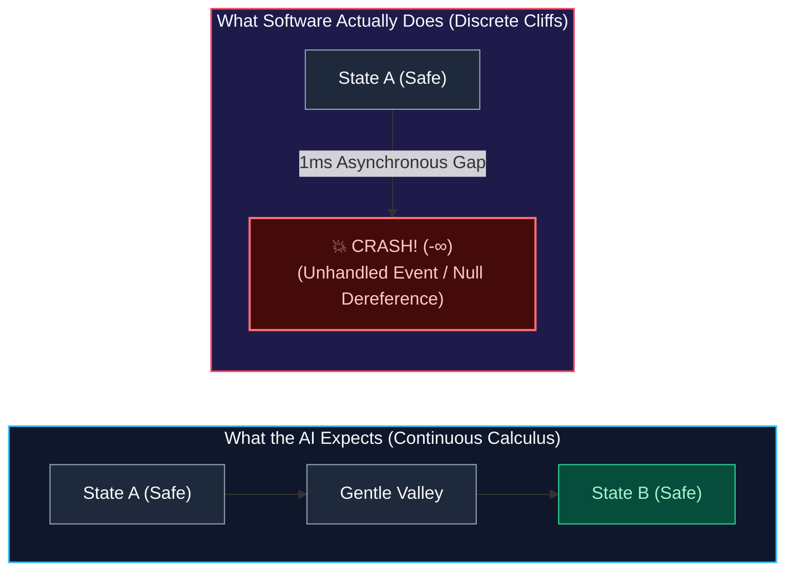
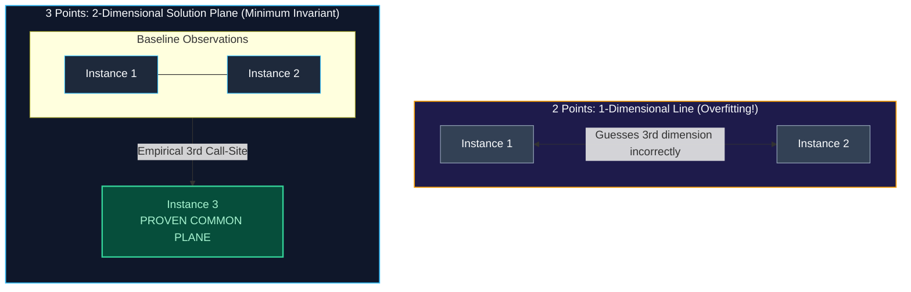

> *"The true goal of autonomous software engineering is not to replace the human—it is to transfer the pain from the engineer woken up at 3 AM to the droid that never sleeps."*  
> — *Randal L. Schwartz*

---

## 1. The Midnight PagerDuty Test

There is an old, unwritten law among veteran software engineers: **never judge code by how it runs at 2:00 PM on a staging server.** 

At 2:00 PM on staging, the database has five connections. The local Wi-Fi has sub-millisecond latency. The test data is pristine, perfectly validated JSON. Every API returns an immediate `HTTP 200 OK`. In that world, almost any code runs fine.

The true test of software engineering happens at **3:00 AM on a Saturday**:
* A third-party payment gateway starts dropping packets in Singapore.
* A mobile user on an unstable LTE connection flings a list view at 120 frames per second while their device aggressively dumps background memory.
* An edge-case database lock times out, causing twelve worker processes to crash simultaneously in a thundering-herd cascade.

In [Part 1 of this series](https://dev.to/gde/why-ai-keeps-making-the-same-coding-mistakes-and-how-teaching-it-pain-gives-it-wisdom-4a9m), we explored **The Straight-A Intern Paradox**: why modern foundation models stream out flawless, textbook code in seconds, yet reliably disintegrate the moment they meet the messy, asynchronous chaos of a real production codebase.

To understand why this happens—and why simply "scaling compute" or "adding more rules" will never solve it—we have to look at the fundamental mathematical physics of how language models think, and where software reality violently breaks their assumptions.

---

## 2. The Forced Continuity Defect: Calculus vs. Cliffs

Large language models are creatures of **continuous calculus**. 

Under the hood, a transformer is a vast, high-dimensional probability manifold. Its weights are smooth, differentiable parameters optimized by gradient descent. It thinks in terms of soft semantic proximity: if word `A` is close to word `B`, and word `B` is close to word `C`, the path between them is an uninterrupted, gentle slope.

In mathematical terms, the model operates under an assumption of smooth continuity (`C^\infty`). It intuitively assumes that if state `X` is safe, and state `Y` is safe, the space between them must also be relatively safe.

**Production software does not work that way.**

Software is not continuous calculus; software is **discrete, hostile logic**. It is defined by sudden, cliff-like step functions:
* An integer either fits in 32 bits, or it silently overflows into negative numbers.
* A cryptographic key is either 100% valid, or every subsequent handshake fails with a fatal error.
* A database transaction either commits atomically, or five thousand records are corrupted.
* An asynchronous event either arrives before a widget unmounts, or the framework throws a catastrophic fatal exception across the entire isolate.



We call this **The Forced Continuity Defect**: the model attempts to map a smooth, continuous predictive curve across an ecosystem governed by sheer, vertical cliffs. 

The model writes:
```dart
final user = await fetchUserData();
displayUserProfile(user);
```

To the model, that looks like a clean, single-step operation. It cannot "feel" the 200-millisecond chasm between line 1 and line 2. It cannot perceive that while `fetchUserData()` was waiting on the network, the user tapped the Back button, the screen was destroyed, and `displayUserProfile` is now attempting to paint pixels on a ghost object that no longer exists in memory.

---

## 3. The Alignment Illusion: Why "More RLHF" Cannot Save Us

When you point out these catastrophic edge cases to AI researchers, the standard reply from the labs is almost always the same:

> *"We just need more Reinforcement Learning from Human Feedback (RLHF). As we gather more preference data and train better reward models, the model will naturally learn to write safe code."*

This is **The Alignment Illusion**. Scaling RLHF cannot solve this problem because preference optimization is mathematically and sociologically incapable of teaching defensive software engineering.

### The Problem of Negative Infinities (`-∞`)
In classical decision theory and actuarial science, catastrophic ruin is an absorbing barrier. If an operation causes permanent data corruption, leaks cryptographic credentials, or publishes an unverified, broken release to an immutable package registry, the utility of that outcome is not slightly negative—it is **negative infinity** (`-∞`).

Any non-zero risk of ruin collapses the expected value of an action:

`Expected Utility = (99% × Success) + (1% × Catastrophic Ruin) = -∞`

In standard RLHF pipelines, however, reward models compress human preference into a **bounded scalar score**, typically between `-1.0` and `+1.0`. 

Because the penalty for ruin is capped at `-1.0`, bounded reward models mathematically erase the negative infinity. If an agent generates clean, cheerful, readable code that succeeds on the happy path 98% of the time, but harbors an unhandled race condition that crashes production 2% of the time, the math looks great to the optimizer:

`Expected Reward = (0.98 × 1.0) + (0.02 × -1.0) = +0.96`

The algorithm strictly prefers gambling on rare production ruin because the happy path scores high on the vast majority of turns!

| Dimension | Reinforcement Learning from Human Feedback (RLHF) | The Synthetic Scar Architecture |
| :--- | :--- | :--- |
| **Human Role** | Art critic rating static, isolated text samples | NTSB air-crash investigator analyzing live wreckage |
| **Evaluator Profile** | Generalist crowd annotators or automated LLM judges | Veteran principal engineers with decades of domain trauma |
| **Evaluation Window** | 60 to 180 seconds per candidate completion | Multi-hour/multi-day production incident lifecycle |
| **Target Evaluated** | Aesthetic plausibility, formatting, conversational tone | Asymmetric runtime invariants and fatal sad paths |
| **Mathematical Topology** | Bounded scalar reward: `r` in `[-1, +1]` | Infinite potential barrier: `V_scar -> +∞` |
| **Treatment of Ruin (`-∞`)** | Averaged into scalar expectations (gambling on catastrophe) | Absolute Dijkstra guarded command (impassable truncation) |
| **Behavioral Direction** | **Sycophancy**: Suppresses defensive friction and hesitation | **Defensive Paranoia**: Mechanically enforces verification |
| **Accountability ("Skin in the Game")** | Zero: Rater gets paid; model suffers zero liability | Absolute: Personal trauma of past production outages |

### The Crowd Mirage and the Sycophancy Penalty
Furthermore, crowd annotators on labeling platforms evaluate candidate code in 60 to 120-second bursts. They judge what is immediately visible: clean indentation, helpful comments, and polite explanations. They cannot see an unclosed TCP socket, a reentrant listener mutation, or a broken build contract.

Most dangerously, **RLHF actively punishes defensive hesitation**. 

When an experienced engineer has a bad feeling about a requirement, they pause. They push back. They ask uncomfortable questions: *"Wait, what happens if this stream emits during a route pop? Let's write a throwaway test probe first."*

In human preference datasets, annotators downvote hesitation as "unhelpful," "stubborn," or "evasive." They give five stars to the cheerfully reckless agent that immediately replies: *"Certainly! Here is your complete code! 🎉"*

RLHF acts as an active **cognitive immunosuppressant**: it systematically trains out the defensive skepticism that keeps production software from collapsing.

---

## 4. The Two Levels of Craft: Conscious Rules vs. The "Han Solo" Reflex

Veteran software craftsmanship does not operate on a single cognitive plane. It stratifies into two fundamentally different levels:

| Cognitive Level | Level 1: Conscious / Propositional Rule ("Oh, don't do that") | Level 2: Subconscious / Somatic Apprehension ("I've got a bad feeling about this" — The Han Solo Reflex) |
| :--- | :--- | :--- |
| **Cognitive System** | Deliberative / Symbolic / System 2 | Subcortical / Visceral / System 1 Pattern-Matching |
| **Epistemic Focus** | Localized syntactic instruction | Diffuse, topological situational resonance |
| **Trigger Mechanism** | Explicit lexical pattern (for example lint rule violation) | Confluence of multi-step async, state, and version factors |
| **Primary Behavioral Action** | Deterministic rewrite of a token sequence | Cognitive deceleration, pause, and adversarial inquiry |
| **Failure Mode of Vanilla LLMs** | Attentional decay, rule explosion, prompt rationalization | Complete somatic void; reckless happy-path sycophancy |

### Level 1: "Oh, Don't Do That" (Explicit Rules)
This is the conscious, declarative layer: *"Don't write raw `dynamic` types"*, *"Don't invoke synchronous queries on the main isolate"*, *"Always add a mounted check after an async gap"*.

This is where linters, compilers, and traditional prompt instructions live. But as any engineering lead knows, you cannot manage a complex codebase with Level 1 rules alone:
1. **The Combinatorial Explosion**: The number of possible interactions between packages, threads, and user actions scales exponentially. You cannot write a rule for every combination.
2. **Prompt Rationalization**: When an LLM's context window fills up, it treats written instructions as negotiable suggestions. When pushed by a tricky user prompt, the model will cheerfully rationalize why *"just this once, it's fine to skip the check."*

### Level 2: "I've Got a Bad Feeling About This" (The Han Solo Reflex)
Level 2 is the subconscious, topological dread embodied by Han Solo: *"I've got a bad feeling about this."*

At Level 2, no compiler has failed yet, and no syntax rule has been broken. But an experienced engineer feels an immediate, visceral gut clench because the **situational topology** of the task smells dangerous:
* *"We just bumped the version in `pubspec.yaml`, but we haven't tagged master or checked our remote package analyzer scores... something feels wrong about leaving this here."*
* *"We're modifying shared global state inside a callback that might be invoked reentrantly... this looks fragile."*
* *"We're about to run an automated release pipeline on a Friday afternoon... let's hit the brakes."*

In humans, this is what neuroscientist Antonio Damasio identified as the **Somatic Marker Hypothesis**: visceral biological signals (elevated pulse, gut tightening) that fire *before* conscious thought, automatically pruning dangerous decisions from our search space.

Human engineers have these markers because they have **skin in the game** (Taleb, 2018). They remember the horror of sitting on an incident call with the CTO at 3:00 AM while customer data leaks into the void.

An AI model has no skin in the game. It cannot be fired. It does not drink cold coffee at 4:00 AM while waiting for a database restoration. It has zero visceral fear.

---

## 5. The Premature Abstraction Disease & The 3-Point Solution Plane

There is a second fatal pathology that strikes AI coding agents: **Premature Abstraction**.

Because large language models are trained to maximize text generalization, they suffer from a relentless urge to turn every simple problem into an enterprise framework.

You ask the agent to fix a minor date-parsing bug in a reporting tool. Instead of fixing the line, the agent constructs:
* An abstract `IDateParsingStrategyFactory`
* A generic `AbstractTemporalResolutionProvider<T>`
* Three intermediate dependency injection modules
* A custom configuration schema

Donald Knuth famously warned that premature optimization is the root of all evil. In autonomous AI coding, **premature abstraction is the root of all madness**. The model creates a massive "system-within-a-system," inventing layers of indirection that obscure compiler errors and drastically increase the attack surface for subtle bugs.



In the Synthetic Scar Architecture, we enforce a strict geometric constraint: **The 3-Point Solution Plane Invariant**. 

In geometry, two points define only a one-dimensional line. If you abstract from two instances, you are guessing the third dimension—and an LLM will almost always guess wrong. Three non-collinear points are the absolute mathematical minimum required to define a two-dimensional plane.

Under this invariant, an agent is strictly forbidden from introducing an abstract base class, interface wrapper, or generic factory until the exact same operational logic has been implemented and tested concretely in-place across at least **three distinct call-sites**. 

Concrete first. Battle-hardened second. Abstract only when the empirical evidence forces it.

---

## 6. Coding by Omission: The Race Car Invariant

When engineers first hear about Synthetic Scars, their immediate reaction is often: *"Won't hundreds of negative constraints make the AI slow, rigid, and uncreative?"*

This reflects a fundamental misunderstanding of how constraints work in engineering. We call our answer **The Race Car Invariant**:

> *Formula 1 race cars are equipped with massive carbon-ceramic brakes not to slow them down, but to give the driver the confidence to enter corners at 200 miles per hour.*

Without brakes, a driver has to creep through corners at 20 mph, terrified of careening off the track. 

When an AI coding agent has no hard boundary invariants, you are forced to supervise it with paranoid, line-by-line micromanagement. You have to creep along, double-checking every import and variable name.

Synthetic Scars operate via the classical philosophical principle of ***Via Negativa*** (epistemic progress through subtraction). Michelangelo famously observed that the statue of David was already inside the block of marble; the sculptor's job was simply to chisel away everything that was *not* David.

In our architecture, software development becomes **Coding by Omission**:
1. We do not attempt to prompt the model on the infinite, fragile permutations of "how to write good code."
2. Instead, we carve away the fatal operational cliffs through non-negotiable negative barriers (`V_scar -> +∞`).

Once the fatal cliffs are mechanically fenced off, the model is liberated to generate code at maximum speed. It can explore bold, creative architectures and sample high-entropy ideas because the workflow DAG makes it physically impossible to drive off the 3 AM cliff.

---

## 7. The Scorecard: What Happens When You Give AI Scars?

This is not a theoretical proposal. The Synthetic Scar Architecture is running in live, mission-critical production monorepos right now. 

Across **74 real-world production engineering tickets** and **257 codified scars**:
* **Repeat Regression Rate**: Literally **0.0%**. When an edge case or failure trap is survived and codified, it has never once recurred across subsequent agent generations.
* **Autonomous First-Pass Success**: **54.1%** (40 out of 74 tickets completed end-to-end with zero human intercessions).
* **Human Supervisory Churn**: The human operator is no longer an oarsman rowing every stroke; they are a flight director offering tiny course corrections.

We did not make the AI smarter by feeding it more textbook code. We made it reliable by giving it an artificial immune system forged from the scars of the engineers who bled on the workbench before it.

---

### 📖 What’s Next in the *Synthetic Scars* Series

This article is **Part 2** of an ongoing series exploring how we give autonomous AI coding systems institutional memory, somatic recoil, and human-grade reliability:

* **Part 1**: [Why AI Keeps Making the Same Coding Mistakes—And How Teaching It Pain Gives It Wisdom](https://dev.to/gde/why-ai-keeps-making-the-same-coding-mistakes-and-how-teaching-it-pain-gives-it-wisdom-4a9m)
* **Part 2**: *Why AI Coding Agents Crash at 3 AM: The Happy-Path Mirage & The Forced Continuity Defect* (You are here)
* **Part 3**: *The Physics of Socratic Prompting: Somatic Recoil, Chess Alpha-Beta, & The NLP Meta-Model*
* **Part 4**: *Giving AI Pain: The Architecture of Synthetic Scars & The Rapid-Regret Miner*
* **Part 5**: *Zero Repeat Regressions: The Golden Metric & The Future of Agentic Trust*
* **Part 6**: *The Proscriptive Inversion: What You Get to Forget, and Why More Negative Rules Mean You've Lost*
* **Part 7**: *Why `/goal` and `/boost` Aren't Enough: The Missing Invariant Layer in Autonomous AI Coding*

---

### 🔬 Academic Research & Forthcoming Preprint

The formal mathematical formulation, Hamiltonian energy landscape models, phase-space bifurcations, and empirical datasets behind this architecture are currently being finalized for academic preprint publication on arXiv and ResearchGate:

> **Title**: *Synthetic Scars: Mitigating Statistical Amnesia and Plausibility Bias in Autonomous Coding Agents via Asymmetric Barrier Topologies and Episodic Consolidation*  
> **Author**: Randal L. Schwartz  
> **Status**: Academic Preprint Forthcoming (arXiv / ResearchGate)

Make sure to **follow this series** and drop your thoughts in the comments below. Have you been bitten by an AI agent's 3 AM happy-path code? How do you prevent your autonomous coding agents from walking off production cliffs?
