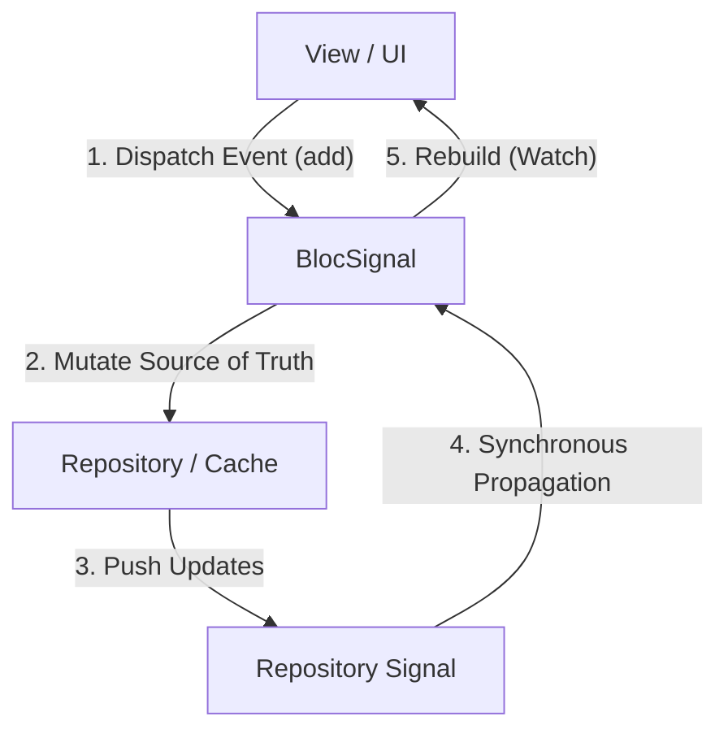

# BlocSignal Core Guidelines & FAQ

This document outlines core synchronous concepts, de-duplication behaviors, and common FAQs for using `bloc_signals`.

---

## 🏗️ Core Architecture & Behaviors

1. **Synchronous Propagation**: Updates via `emit(newState)` propagate **synchronously**. Downstream recalculations and widget rebuilds occur in the exact same frame.
2. **Automatic De-duplication**: Signals automatically de-duplicate identical states using `==` equality. If you call `emit()` with a state equal to the current state, downstream effects and builders will **not** trigger.
3. **Lifecycle & Disposal (`isClosed`)**: Calling `close()` disposes of the underlying `SignalModel` effect tracking and marks the bloc as closed (`isClosed = true`). Subsequent events or emits are dropped.
4. **Stream Transformations**: Standard stream-transformer properties (e.g. `debounce`, `throttle`) are not available. Use custom timing triggers or signals utilities.

---

## ❓ FAQ & Common Patterns

### 1. Sealed Classes and Event/State Exhaustiveness

#### Q: If the event or state class of a `BlocSignal` is a `sealed` class, is there an exhaustiveness check for `.on<T>` blocks?
**A:** No. Because `.on<T>` handles event registration dynamically at runtime (by adding handlers to an internal registry list during constructor initialization), the Dart compiler cannot statically analyze or enforce exhaustiveness checks on these registration blocks.

#### How to get compile-time safety:
If you want the compiler to guarantee that every subclass of a sealed `Event` class is explicitly handled, override `onEvent(Event event)` directly in your subclass and use a Dart `switch` statement or a `switch` expression. The compiler will then enforce full exhaustiveness checks:

##### Option A: Switch Statement (switch-case)
```dart
class CounterBloc extends BlocSignal<CounterEvent, int> {
  CounterBloc() : super(initialState: 0);

  @override
  FutureOr<void> onEvent(CounterEvent event) {
    // The compiler will throw an error if any subclass of CounterEvent is not handled.
    switch (event) {
      case Increment():
        emit(stateValue + 1);
      case Decrement():
        emit(stateValue - 1);
    }
  }
}
```

##### Option B: Switch Expression
```dart
class CounterBloc extends BlocSignal<CounterEvent, int> {
  CounterBloc() : super(initialState: 0);

  @override
  FutureOr<void> onEvent(CounterEvent event) {
    // Highly readable; compiler enforces that every branch evaluates to a state
    final nextState = switch (event) {
      Increment() => stateValue + 1,
      Decrement() => stateValue - 1,
    };
    emit(nextState);
  }
}
```


---

### 2. Using Signals Utilities (`effect`, `computed`)

#### Q: How do I use `effect()` and `computed()` with a `BlocSignal`, both inside the constructor and as a consumer?
**A:** `aBlocSignal.state` exposes a `ReadonlySignal<StateType>` directly. This allows you to integrate with all core `signals` primitives seamlessly.

#### ── In the Constructor (Internal) ──
Declaring reactive primitives directly within the `BlocSignal` subclass constructor is ideal for encapsulation and automatic lifecycle management.

* **`effect` in the Constructor**: Subclass constructor bodies run *after* the super constructor (where the base `createModel` executes). Because of this, effects declared inside the subclass constructor are **not** automatically disposed when the bloc is closed.
  
  > [!IMPORTANT]
  > **Always capture and dispose subclass effects in `close()`**, especially if they listen to long-lived external signals (like repositories). Failure to do so creates memory leaks and causes post-close emission assertions to fail.

  ```dart
  class LoggingCounterCubit extends CubitSignal<int> {
    late final void Function() _disposeEffect;

    LoggingCounterCubit() : super(initialState: 0) {
      _disposeEffect = effect(() {
        print('Transitioned to state: $stateValue');
      });
    }
    
    void increment() => emit(stateValue + 1);

    @override
    void close() {
      _disposeEffect(); // Clean up subclass effect
      super.close();
    }
  }
  ```


* **`computed` in the Constructor**: Define a `late final ReadonlySignal<T>` to hold the derived signal, and initialize it inside the constructor by referencing `state`:
  ```dart
  class CounterCubit extends CubitSignal<int> {
    late final ReadOnlySignal<int> tripleValue;
  
    CounterCubit() : super(initialState: 1) {
      tripleValue = computed(() => state() * 3);
    }
  
    void increment() => emit(stateValue + 1);
  }
  ```

#### ── As a Consumer (External) ──
Consumers who hold an instance of a `BlocSignal` can read and react to state changes externally.

* **`effect` as a Consumer**: An external consumer can register an effect on `bloc.state`. Since it is registered externally, the consumer **must manually dispose of the effect** when it is no longer needed to prevent memory leaks:
  ```dart
  final myBloc = CounterCubit();
  
  // Create effect and keep dispose function
  final dispose = effect(() {
    print('Consumer received new state: ${myBloc.state()}');
  });
  
  // Clean up manually when done (e.g. on widget dispose)
  dispose();
  ```
  > [!IMPORTANT]
  > **This is NOT necessary when using Flutter UI builders (`BlocSignalBuilder`, `SignalBuilder`, or inheriting from `SignalWidget`).** 
  > These widgets manage the subscription lifecycle internally and automatically unsubscribe when the widget is unmounted from the tree. You do not need to call `effect` inside UI build methods; simply reading the signal's value triggers automatic rebuilds. In fact, calling `effect()` inside a `build` method is a performance anti-pattern.

* **`computed` as a Consumer**: Consumers can derive their own computed values using `bloc.state` or any custom computed signals exposed by the bloc:
  ```dart
  final myBloc = CounterCubit();
  
  // Create consumer-level computed signal
  final isStateEven = computed(() {
    return myBloc.state() % 2 == 0;
  });
  ```


---

### 3. Unidirectional Data Flow & Repository Synchronization (MVI vs. MVVM)

#### Q: Is BlocSignal unidirectional? How do we prevent localized duplicate state that gets out of sync with the repository/cache?
**A:** Yes, `BlocSignal` enforces a strictly **Unidirectional Data Flow (UDF)**. 

The concern that BLoC can feel like MVVM (where local state is mutated and trusted over the repository) typically occurs when local controllers duplicate repository data instead of subscribing to it. `BlocSignal` combined with the `signals` ecosystem resolves this by supporting **reactive repositories**:

1. **Local vs. Global Source of Truth**:
   * For pure UI-centric states (e.g., tab selection, dialog open/close), mutating state directly inside the BLoC is clean and appropriate.
   * For domain/business states (e.g., user profiles, products), the **Repository** is the single source of truth. The repository exposes its cache reactively via a `ReadonlySignal`.
2. **Reactive Composition**:
   * Instead of duplicate, localized caching in the BLoC, the BLoC can compose the repository's signal using `computed` or `effect`.
   * When an event is dispatched to the BLoC (e.g., `UpdateTodo`), the BLoC calls the repository (e.g., `repository.saveTodo(todo)`).
   * The repository performs the mutation and updates its internal signal.
   * The BLoC's state (which is bound to the repository's signal) updates **synchronously**, propagating the change back to the UI.

##### Architectural Diagram:


#### Q: How does BlocSignal's separation of concern compare to Riverpod's?
**A:** Both frameworks separate reading and writing, but they do so through different interfaces:
* **Riverpod**: Widgets use `ref.watch(provider)` to read and invoke notifier methods directly (e.g., `ref.read(p.notifier).doAction()`) to write.
* **BlocSignal**: 
  * **Reading**: Fully reactive. The UI watches a `ReadonlySignal<State>` exposed by `bloc.state`.
  * **Writing**: Fully decoupled via events (`bloc.add(Event)`). The UI does not know *how* the action is implemented. This event-driven boundary is what enables robust tracing (e.g., OpenTelemetry spans with event correlation), logging, and decoupled middleware.


---

### 4. Awaiting Event Completion (Solving the Async Coordination / Mutation Problem)

#### Q: How do we await the asynchronous result of an event dispatched via `.add()` in the UI?
**A:** Because `BlocSignal.add` returns `void` (following the classic BLoC pattern to decouple event trigger from handler execution), you cannot directly `await` the `add()` call. 

This is the exact problem that **Riverpod 3.0's Mutations** were designed to solve (tracking and awaiting transient side-effects without polluting the main state). With `BlocSignal` and `signals`, we solve this coordination using two main patterns:

##### Option A: The Completer Pattern (Recommended for Forms / Actions)
Pass a `Completer` inside the event. The handler completes it when the async task completes, allowing the UI to await the result or catch the error locally.

1. **Event Definition**:
   ```dart
   class LoginSubmitted extends AuthEvent {
     final String email;
     final String password;
     final Completer<void>? completer;
     LoginSubmitted({required this.email, required this.password, this.completer});
   }
   ```
2. **Event Handler**:
   ```dart
   on<LoginSubmitted>((event, emit) async {
     emit(AuthLoading());
     try {
       await api.login(event.email, event.password);
       emit(AuthSuccess());
       event.completer?.complete(); // Resolve
     } catch (e, st) {
       emit(AuthFailure(e));
       event.completer?.completeError(e, st); // Propagate error
     }
   });
   ```
3. **UI / Widget Invocation**:
   ```dart
   final completer = Completer<void>();
   context.read<AuthBloc>().add(LoginSubmitted(email: email, password: password, completer: completer));
   
   try {
     await completer.future;
     Navigator.pushReplacementNamed(context, '/home');
   } catch (err) {
     // Handle error locally in the button / form action
   }
   ```

##### Option B: The Signal-to-Stream Pattern (State Transition Awaiting)
Convert the state signal to a stream using the `.toStream()` extension, and await the target state transition.

```dart
// 1. Prepare future before adding event
final successFuture = context
    .read<AuthBloc>()
    .state
    .toStream()
    .firstWhere((state) => state is AuthSuccess);

// 2. Dispatch event
context.read<AuthBloc>().add(LoginSubmitted(email: email, password: password));

// 3. Await completion
await successFuture;
Navigator.pushReplacementNamed(context, '/home');
```


